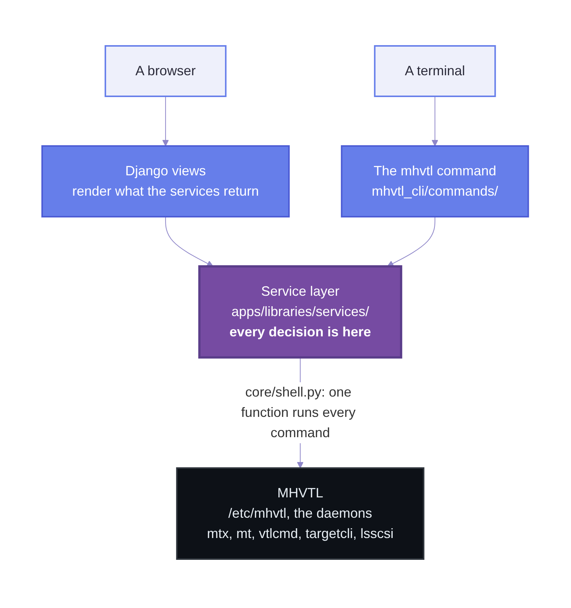
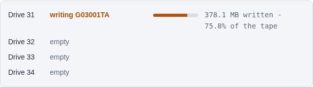
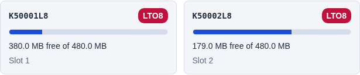

*واجهة ويب وسطر أوامر لمكتبة أشرطة افتراضية — والقاعدة التي جمعتهما معًا*

2026-09-22، كُتب عند الإصدار 2.1.1 · حُدِّث 2026-10-07 عند 3.4.0

## السؤال الذي بدأ كل شيء

مكتبة الأشرطة خزانة: رفوف من الخراطيش، وبضعة محركات تقرأ منها وتكتب عليها، وذراع
روبوتية تنقل الخراطيش بين الاثنين. تتحدث برامج النسخ الاحتياطي معها عبر SCSI، البروتوكول
نفسه الذي يستخدمه القرص. والمكتبات الحقيقية تكلّف ثمن سيارة، وتعيش في غرف ذات أرضيات
مرتفعة.

MHVTL برنامج Linux يتظاهر بأنه واحدة منها. وحدة نواة ومجموعة من الخدمات الخلفية تحاكي
الروبوت والمحركات؛ فترى النواة أجهزة SCSI حقيقية، وحين تكتب برامج النسخ الاحتياطي إلى
"شريط"، يكتب MHVTL ملفًا على القرص بدلًا منه. لا تعرف Bareos ولا Bacula ولا Amanda ولا
أبناء عمومتها التجارية الفرق أبدًا. بهذه الطريقة تختبر استراتيجية نسخ احتياطي دون شراء
روبوت أشرطة.

لكنه يُدار يدويًا بالكامل. المكتبة سجلٌّ في `/etc/mhvtl/device.conf`؛ ومحتوى خاناتها في
`/etc/mhvtl/library_contents.N`؛ والخدمات الخلفية وحدات `systemctl`؛ ونقل خرطوشة يتم بـ`mtx`؛
وسؤال المحرك عن أي شيء يتم بـ`mt` أو `sg_*`. لا شيء من ذلك صعب، لكن كل شيء فيه سهل الخطأ
قليلًا، ولا شيء يخبرك حين تخطئ.

فكان السؤال بسيطًا: *هل يمكنك تشغيل MHVTL من المتصفح، دون أن تفقد يومًا القدرة على
تشغيله من الطرفية؟*

MHVTL Console هو الجواب. وهو الآن متاح للعموم، بالإصدار 3.4.0:

- الشيفرة المصدرية والإصدارات: `github.com/abdelhaleemahmed/mhvtl-console`
- التوثيق: `abdelhaleemahmed.github.io/mhvtl-console`

هذا المقال عن كيفية بنائه، وما الذي أخطأ في الطريق، والقاعدة الواحدة التي حسمت كل شيء
تقريبًا.

> **كُتب عند الإصدار 2.1.1 في سبتمبر 2026، ويُحدَّث باستمرار.** الأرقام أدناه أُعيد
> قياسها؛ وأُضيفت في أكتوبر خمسة أقسام في النهاية — *ملفات التعريف والتهيئات المحفوظة*،
> و*إطار واحد لخمسين صفحة*، و*عِلّة النواة التي كشفها*، و*ما حجم الشريط؟*، و*ما تغيّر
> منذ 2.1.1* — تقول ما وصل بعد كتابة الأصل. ولم يُحذف شيء ممّا بينها، فحيث يصف قسمٌ
> مبكّر كيف كان شيءٌ ما في سبتمبر، تقول الأقسام اللاحقة ما صار إليه. وقسم حجم الشريط
> يقول أيضًا أين انتهت حدود القاعدة التي يتحدّث عنها هذا المقال.

## بالأرقام

| | |
| --- | --- |
| مصنّعو المكتبات الذين يعرفهم | 9 — IBM وStorageTek وHP وQuantum وADIC وSpectra Logic وOverland وDell وSony |
| تركيبات المكتبات المبنية من البداية إلى النهاية | 85 (مصنّع × طراز × عائلة خراطيش) |
| أسماء أوامر `mhvtl` | 14 |
| سمات الألوان | 4 |
| الاختبارات | 2,126، في نحو دقيقتين، دون MHVTL ودون صلاحيات root |
| إصدارات Python في التكامل المستمر (CI) | 3.11 و3.12 و3.13 |
| أشجار التوثيق | 5، كلٌّ منها مبني بالإنجليزية والعربية (من اليمين إلى اليسار) |
| الإصدار العام | 3.4.0، بترخيص GPL-2.0-only |
| أسطر الشيفرة | 45,340 سطرًا من Python للتطبيق — التفصيل أدناه |

الشيفرة، محسوبةً من المصدر المُودَع في المستودع، بما فيها التعليقات ونصوص التوثيق:

| الجزء | الملفات | الأسطر |
| --- | ---: | ---: |
| شيفرة Python للتطبيق، دون الاختبارات | 250 | 45,340 |
| &nbsp;&nbsp;منها طبقة الخدمات | 90 | 22,048 |
| &nbsp;&nbsp;منها عروض الويب | 11 | 9,134 |
| &nbsp;&nbsp;منها أمر `mhvtl` | 23 | 4,764 |
| الاختبارات | 92 | 26,181 |
| قوالب HTML | 66 | 14,309 |
| CSS | 9 | 3,545 |
| JavaScript | 12 | 1,180 |
| التحزيم — RPM والمثبّت والبناء | 15 | 2,265 |
| **الإجمالي** | **444** | **92,820** |

*(أُعيد القياس في أكتوبر 2026 عند الإصدار 3.4.0. وكان العدد نفسه عند 3.3.1 هو 438 ملفًا
و89,644 سطرًا؛ وكانت أرقام سبتمبر عند 2.1.1 هي 299 ملفًا و59,923 سطرًا. ولا يحتسب العدد
أشجار التوثيق ولا أصول `asciinema-player` المضمّنة في أطقم التسجيل، وإلّا لأضافت نحو
اثني عشر ألف سطر من CSS كتبه غيرنا.)*

*كل صفٍّ قاعدةُ مسارٍ واحدة، تُطبَّق على الشجرة المُودَعة عند وسم الإصدار، فتكون الأرقام
قابلة للمقارنة بين إصدار وآخر لا مُقاسةً بطريقة مختلفة كل مرّة: طبقة الخدمات هي كل ما
تحت `services/`، وعروض الويب هي `views.py` و`*_views.py`، والأمر هو كل `mhvtl_cli/`،
والاختبارات هي كل مجلّد `tests/` تحت `apps/`.*

## ماذا يفعل

من لوحة التحكم ومن صفحة لكل مكتبة، وبالقدر نفسه من أمر `mhvtl`:

- **إنشاء المكتبات** من ملفات تعريف تسعة مصنّعين — IBM وStorageTek وHP وQuantum وADIC
  وSpectra Logic وOverland وDell وSony — وحذفها مرة أخرى؛
- **ملؤها بالأشرطة**، بباركودات تخبر بجيلها (`K50001L8` خرطوشة LTO-8)؛
- **نقل الخراطيش بالروبوت**: تحميل محرك، وتفريغه، والنقل بين الخانات؛
- **تصدير مكتبة عبر iSCSI**، لترى آلة أخرى مكتبة أشرطة حقيقية، ثم استعادتها بنظافة؛
- **مراقبة كل محرك بينما يكتب إليه النسخ الاحتياطي** — يكتب، يقرأ، يحمل شريطًا أو فارغ،
  ومدى امتلاء الخرطوشة؛
- رؤية المضيف نفسه: الخدمات الخلفية، ووحدات النواة، وأجهزة SCSI التي أنشأها MHVTL، والقرص
  الذي تعيش عليه الأشرطة.

إنشاء مكتبة من الطرفية يبدو هكذا — تشغيل حقيقي:

```console
$ sudo mhvtl library create --profile STK --id 50 --drives 2 \
     --media-type LTO8 --drive-model ULT3580-TD8 --tapes 3 --empty-slots 3

ok   validate  Specification is valid
ok   create    Library 50 created: STK SL500 with 2 drives
ok   restart   Restarted vtllibrary@50.service
ok   verify    MHVTL can see library 50
ok   media     3 tape(s) created, 0 already present in library 50
Library 50 created
```

ومراقبتها بينما يكتب إليها النسخ الاحتياطي:

```console
$ sudo mhvtl status activity 50

Library 50: 1 of 2 drive(s) hold a tape, 1 working

DRIVE  STATE    BARCODE   COUNTERS
-----  -------  --------  --------------------------------------------
51     writing  K50001L8  300.0 MB written - 29.6% of the tape
52     empty    -         -
```

تعرض صفحة الويب الشيء نفسه، في لوحة تتحدث كل خمس ثوانٍ، مع شريط يبيّن مدى امتلاء
الشريط. إنها الإجابة نفسها، من الشيفرة نفسها — وهذه هي القصة كلها.

لوحة التحكم: خدمة MHVTL، وكل المكتبات، والمهام الشائعة.


صفحة لكل مكتبة، بكل ما يمكن فعله بها، والمكتبة مختارة مسبقًا:


## القاعدة

كل واجهة كهذه تبدأ بالطريقة نفسها. تحتاج الصفحة إلى إظهار ما إذا كان المحرك مشغولًا،
فتجلب بضعة أسطر من JavaScript قراءتين، وتقارنهما، وتقرر أن المحرك يكتب، وتنسّق عدد
البايتات، وتختار لونًا. إنها تعمل. وتبدو جيدة في العرض التوضيحي.

ثم يطلب أحدهم المعلومة نفسها من سطر الأوامر، فلا يوجد أمر يستطيع الإجابة، لأن الإجابة
لا توجد إلا داخل متصفح. والطريقة الوحيدة لتوفيرها نسخة ثانية من القاعدة، بلغة Python —
ونسختان من قاعدة واحدة لا تبقيان متطابقتين. إنهما تبدوان كذلك فقط، إلى أن تُعدَّل عتبة في
إحداهما. في هذا المشروع حدث ذلك فعلًا: ظهرت الخرطوشة نفسها *تمتلئ* في بطاقة و*عادية* في
البطاقة المجاورة، لأن بلاطات الأشرطة ولوحة المحركات كان لكلٍّ منهما تعريفه الخاص لـ"شبه
ممتلئ".

لذلك يسير المشروع على قاعدة واحدة:

> **الخدمات تقرّر. والصفحة وسطر الأوامر يعرضان فقط.**

كل قرار — ماذا يفعل المحرك، وما مدى امتلاء الشريط، وماذا يعني "ممتلئ"، وأي المحركات
يقبلها طراز مكتبة، وهل الباركود صالح، وكيف يُكتب الحجم — يُتخذ مرة واحدة، في طبقة خدمات
بلغة Python. تستدعيها عروض الويب وواجهة سطر الأوامر، وتطبع ما تعيده. أما JavaScript في
الصفحة فيبدّل HTML صيّره الخادم، ويتذكّر سمة الألوان التي اخترتها. ولا يحسب شيئًا.

والنتيجة أن سطر الأوامر لا يمكن أبدًا أن يتأخر عن الصفحات. كل ما تستطيعه الواجهة
يستطيعه `mhvtl`، لأنه لا يوجد له إلا تنفيذ واحد.

## ثلاث طبقات



قرابة نصف شيفرة Python في التطبيق هو طبقة الخدمات: 22,048 من أصل 45,340 سطرًا. أما
العروض التي تخدم كل الصفحات فـ9,134 سطرًا، وسطر الأوامر كله 4,764 — صغيران، لأن أيًّا
منهما لا يقرّر شيئًا. والاختبارات، بـ26,181 سطرًا، تزيد على الخدمات في الحجم، عن قصد —
والمزيد عن ذلك أدناه.

### كل خدمة تعيد الشكل نفسه

```python
@dataclass
class ServiceResult:
    success: bool
    message: str                    # one sentence, for a person
    data: Optional[Dict] = None     # what the caller asked for
    errors: List[str] = field(default_factory=list)
    operation_id: Optional[str] = None
```

لا قاموس مجرد، ولا `None`، ولا استثناء لإخفاق عادي. عبارة *There is no library 99* (لا توجد
مكتبة 99) إجابة عن سؤال، لا حدث استثنائي، فتعود قيمةً — `message` هي العنوان، و`errors` هي
المساعدة (*device.conf has 10, 20, 30*).

هذا الشكل هو ما يجعل سطر الأوامر رخيصًا. دالة واحدة تطبع أي نتيجة، نصًّا أو بصيغة
`--json`، مع رمز الخروج الصحيح، دون أن تعرف أي خدمة أنتجتها. ويستطيع عرض الويب تصيير الصفحة
العادية وفيها الإخفاق، ضمن إطار الواجهة وسمتها، مع الحالة 404 — بدلًا من صفحة الخطأ
المجرّدة في Django.

والوحدة التي تعرّف هذا النوع تحمل ندبة في نص توثيقها: قبل إعادة الهيكلة لم تكن *أي* وحدة
تستوردها، بينما نمت أربعة أصناف `ServiceResult` متنافسة في وحدات مختلفة، لكلٍّ منها
تصوّره الخاص للحقول. كان على المستدعي أن يعرف أي خدمة استدعى كي يقرأ الإجابة. ودمجها في
صنف واحد هو ما جعل واجهة سطر الأوامر ممكنة.

### كل أمر يمر عبر دالة واحدة

`core/shell.py` هي الوحدة الوحيدة في طبقة الخدمات التي تستورد `subprocess`. وهي تفرض ثلاثة
أشياء لا يستطيع أي موضع استدعاء نسيانها:

- **مهلة زمنية، دائمًا** — وإلا فإن `mtx` عالقًا يحتجز عامل ويب حتى يعيد أحدهم تشغيل
  الخدمة؛
- **قائمة، لا سلسلة نصية أبدًا** — فالباركود الذي فيه فاصلة منقوطة يبقى باركودًا؛
- **نوع نتيجة واحد** — `.ok` و`.output`، وإخفاق يقتبس أمره بنفسه.

وهي أيضًا ما يجعل مجموعة الاختبارات ممكنة، لأن الاختبار يستطيع أن يعيد ما *كان* الأمر
سيطبعه دون تشغيله. والمزيد عن ذلك أيضًا.

### سطر الأوامر: اسم، ثم فعل

`mhvtl library create`، و`mhvtl tape list 50`، و`mhvtl status activity 50`، و`mhvtl iscsi
unexport 50` — أربعة عشر اسمًا (`library` و`drive` و`tape` و`operations` و`status`
و`service` و`config` و`scsi` و`iscsi` و`console`، ثم `profile` و`preset` و`ltfs`
و`settings` التي وصلت لاحقًا)، كلٌّ منها وحدة تسجّل أفعالها. القراءة متاحة للجميع؛
وكل فعل يغيّر شيئًا يبدأ بفحص صلاحيات يقول ما الذي يسمح به — *إنشاء مكتبة يتطلب العضوية
في مجموعة mhvtl؛ أنت …، في …. شغّل "sudo usermod -aG mhvtl …" وسجّل الدخول من جديد، أو
شغّل هذا الأمر عبر sudo* — بدلًا من مجرد *permission denied*. وهو يقرأ `/etc/mhvtl`
افتراضيًا، أيًّا كانت إعدادات خادم الويب: فالأمر الذي يقرّر ما يفعله من نسخة قديمة ثم
يتصرف في وحدات systemd حقيقية أمرٌ خطر.

## مراقبة المحرك: أصعب ميزة

المحرك لا يُبلغ بأنه *يكتب*. هذا استنتاج.

تحتفظ خدمات المحركات في MHVTL بعدّادات — البايتات المكتوبة والمقروءة — وقد أضفنا طريقة
لطلبها: `vtlcmd <drive> stats`، وهي الرقعة 0004 التي أضفناها إلى MHVTL. تحتفظ النواة بحجز
SCSI لمن يشغّل النسخ الاحتياطي، فلا يستطيع `mt` ولا `mtx` سؤال المحرك عن أي شيء أثناء
عمله؛ أما عدّادات الخدمة نفسها فتستطيع. قارِن قراءتين تفصل بينهما بضع ثوانٍ: إن زادت
البايتات *المكتوبة*، فالمحرك يكتب.

أثبتنا ذلك من البداية إلى النهاية بكتابة حقيقية بحجم 600 ميغابايت، ونحن نراقب الشريط
يتحرك من 0% إلى 59.2%. ثم بدأ يكذب.

**تذبذبت الحالة.** أثناء نسخ احتياطي مستقر، كانت اللوحة تتناوب بين *يكتب* و*يحمل شريطًا*.
سببان، في آنٍ واحد:

1. تعمل الواجهة تحت gunicorn بثلاث عمليات عاملة. احتفظت كلٌّ منها بذاكرتها الخاصة لآخر
   قراءة، فكانت الطلبات المتتالية — التي تصل إلى عمّال مختلفين — تقارن بماضٍ مختلف.
2. عدّادات MHVTL مخزّنة مؤقتًا. قراءتان يفصل بينهما أقل من ثانية قد تعيدان الرقم نفسه من
   محرك مشغول.

الحل مخزن صغير مشترك — ملف — لآخر قراءة لكل محرك، بقاعدتين: العيّنة الأحدث من ثلاث ثوانٍ لا
تستحق المقارنة بها، والتعادل يُبقي على الحالة الأخيرة بدلًا من الرجوع إلى *يحمل شريطًا*.
والملف قابل للقراءة والكتابة من خدمة الويب ومن `mhvtl` بصلاحيات root على سطر الأوامر معًا،
فترى الطرفية والصفحة التاريخ نفسه.

**المحرك الذي لم يكتب شيئًا ظهر بشرطة** لا بـ*0 MB*. استخدم القالب مرشّح `|default` في Django،
الذي يعمل مع أي قيمة خاطئة — و`0` قيمة خاطئة. والحل هو `|default_if_none`. وقد كلّف الفخ نفسه
صفحة المكتبة من قبل عددًا صحيحًا للخانات الفارغة: مكتبة ممتلئة، خاناتها الفارغة صفر، أظهرت
رقمًا قديمًا مخزّنًا بدلًا من 0.

القرار كله يعيش الآن في طريقة خدمة واحدة، `activity()`. تطلب الصفحة جزءًا صيّره الخادم كل
خمس ثوانٍ وتستبدله؛ ويطبع `mhvtl status activity` القيم نفسها. لا يوجد JavaScript يقارن
العدّادات.



## كم امتلأ شريط قابع في خانته؟

يستطيع المحرك أن يخبرك بما على الشريط الذي بداخله. لكن الخرطوشة على الرف لا محرك لها.

يحفظ MHVTL كل خرطوشة دليلًا من الملفات، أحدها `mam`، وهو *ذاكرة الوسيط المساعدة* (Medium
Auxiliary Memory) للخرطوشة — الشريحة التي تحملها خرطوشة LTO حقيقية، بسماتها. وهي ثنائية:
رأس من ثمانية بايتات، ثم سلسلة من السمات، لكلٍّ منها معرّف وطول وقيمة. السمة `0x0000` هي
*السعة المتبقية*، و`0x0001` هي *السعة القصوى*، وكلٌّ منهما رقم من ثمانية بايتات بترتيب
big-endian، بوحدة MiB. اقرأهما، فيصبح للشريط في الخانة 12 حجم — تُظهر بلاطات الأشرطة شريطًا،
وتوقّف `mhvtl tape list` عن طباعة `-` في عمود السعة لكل شريط ليس في محرك.



تعود الملفات إلى root؛ والواجهة لا تعمل بصلاحيات root. فهي تقرؤها عبر `sudo`، وملف `sudoers`
يسرد بالضبط البرامج التي يُسمح لها بتشغيلها بهذه الطريقة. استخدمت النسخة الأولى
`sudo sh -c 'cat …'`، فأمسك بها اختبار يفحص كل أمر تشغّله الشيفرة عبر `sudo` مقابل تلك
القائمة: `sh` ليس فيها، ولا ينبغي أن يكون أبدًا. فأُعيدت كتابتها لتقرأ ملفات MAM لمكتبة
كاملة بأمر `tar -cf -` واحد.

ومسار الشريط يُبنى من الباركود ثم يُسلَّم لاحقًا إلى `rm -rf`، لذا يُفحص مرتين: يجب أن يكون
الباركود باركودًا، ويجب أن يقع المسار المحلول مباشرة داخل دليل الوسائط. وهذا أحد الموضعين
اللذين *تُطلق* فيهما طبقة الخدمات استثناءً — لأن المستدعي الذي يصل إلى هناك بمسار خاطئ لديه
علّة في الشيفرة، لا يومٌ سيئ.

## معرفة الأجهزة

يسجّل `device.conf` ما اختاره أحدهم. ولا يعرف ما كان مسموحًا. أي المحركات يقبلها STK
SL500؟ وأي الخراطيش يكتب عليها محرك LTO-7، وأيها يستطيع قراءته فقط؟

تحمل الواجهة معرفتها الخاصة، ولم يُكتب أيٌّ منها يدويًّا. قُرئت ملفات التعريف من مصدر
MHVTL — `usr/pm/*.c`، حيث تُسجَّل *شخصية* كل مكتبة — وتتبع جداول التوافق القواعد الفعلية
للمحركات.

وهذا مهم لأن القواعد التقريبية تخطئ تحديدًا حيث يعتمد عليها الناس. أشهرها في LTO: *المحرك
يكتب جيله وجيلًا واحدًا قبله، ويقرأ جيلين قبله*. تصح من LTO-3 حتى LTO-7. **وكسرها LTO-8**:
محرك LTO-8 لا يقرأ شيئًا لا يستطيع كتابته، ولا يستطيع قراءة خرطوشة LTO-6 إطلاقًا. المعادلة
ستكون مخطئة بثقة في هذا الموضع تحديدًا؛ أما الجدول فلا. (اكتشفنا ذلك بالطريقة المحرجة:
مسودة أولى من الدليل التعليمي للمشروع طبّقت القاعدة التقريبية، فقالت إن محرك LTO-8 يقرأ LTO-6،
واضطررنا إلى تصحيحها وفق الجداول الحقيقية.)

ويصف مقال مرافق، *Every Library, Through the Browser* (كل مكتبة، عبر المتصفح)، بناء كل مكتبة
تعرضها الواجهة — 85 تركيبة من المصنّع والطراز وعائلة الخراطيش — والأعطال الثلاثة في MHVTL
التي ظهرت أثناء ذلك.

## iSCSI: تصدير مكتبة، واستعادتها

تكون المكتبة الافتراضية أنفع ما تكون حين تستطيع آلة *أخرى* استخدامها — خادم النسخ
الاحتياطي، لا مضيف MHVTL. تصدّر الواجهة المكتبة عبر iSCSI باستخدام `targetcli`: هدفٌ
(target)، ومخزنٌ خلفي (*backstore*) للروبوت ولكل محرك، وكلها معروضة لبادئ (initiator)
واحد.

وقد علّمتنا استعادتها أحدّ درس في المشروع. **حذف هدف iSCSI يترك مخازنه الخلفية وراءه**، وهي
لا تزال تُبقي أجهزة SCSI مفتوحة. تبدو المكتبة قد اختفت؛ لكن أجهزتها ليست حرّة. والحل هو
`mhvtl iscsi unexport <library>`، الذي يزيل الهدف *والمخازن الخلفية* التابعة له — ويتعرف عليها
بقاعدة تسمية واحدة، `lib<id>_changer` و`lib<id>_drive<n>`، مكتوبة مرة واحدة كتعبير نمطي.
استخدمت نسخة مبكرة قاعدتين مختلفتين لسؤال "هل هذا لنا؟" في موضعين، وقبلت إحداهما
`lib50_drivefoo`؛ وصار ذلك الآن اختبارًا.

## مظهر واحد، أربع سمات

للواجهة أربع سمات ألوان — Console Navy وGraphite وDaylight وSepia — ولا تسمّي أي من
قواعدها لونًا. كل لون رمزٌ مميّز (token) — `--surface` و`--accent` و`--ok` و`--warn`
و`--bad` — والسمة ليست إلا مجموعة قيم مختلفة للأسماء نفسها. تقول الخدمة إن الشريط `full`؛
ويكتب القالب هذه الكلمة صنفًا (class)؛ وتعطي ورقة الأنماط الصنفَ `--bad`؛ وتقول السمة كيف يبدو
`--bad`. تغيير العتبة سطر واحد في Python؛ وتغيير اللون سطر واحد لكل سمة.

تفصيلتان استحقّتا مكانهما بالطريقة الصعبة:

- **`--accent-ink`**، لون النص *فوق* اللون المميّز. الترويسة بلون المميّز؛ في Daylight يجب
  أن يكون النص عليها أبيض، وفي Console Navy داكنًا. السمة التي تخلو من هذا الرمز لها ترويسة
  لا يمكن قراءتها، في سمة واحدة بالضبط.
- **كل قاعدة محصورة في صنف لا يضعه إلا القالب الأساسي.** وهذا يجعل الصفحة التي تجاوزت
  القالب الأساسي تفشل *بشكل مرئي* — بلا تنسيق — بدلًا من أن تعمل نصف عمل. وقد كان في
  المشروع بالضبط النوع الذي يعمل نصف عمل: نوافذ حوار لها `<head>` خاص بها، بيضاء في واجهة
  داكنة، وتبدو جيدة في السمة التي استخدمها كاتبها. وتطلّب تحويلها موجةً من إعادة الهيكلة لكل
  قسم.

## فخاخ وقعنا فيها، كي لا تقع أنت

بعضها خاص بـDjango أو MHVTL. ومعظمها ليس كذلك.

**الصفحة الفارغة تُقرأ كواجهة معطّلة.** الرابط الذي لا يقبل إلا POST — أي وجهة نموذج —
يجيب طلب GET من المتصفح بالرمز 405 و*جسم فارغ*. من يحفظه في المفضلة، أو يضغط Enter في شريط
العنوان بعد الإرسال، يحصل على صفحة بيضاء. هذه الروابط تعيد التوجيه الآن إلى الصفحة التي
يعيش فيها النموذج؛ أما التي يستدعيها JavaScript فتجيب بـJSON يقول ما الذي تقبله. واختبار
يفحص كل رابط من هذا النوع.

**الترقية يجب أن تعيد تشغيل الخدمة.** تحتفظ عمليات gunicorn العاملة بالشيفرة التي بدأت بها،
فثُبّت الإصدار 2.1.0 وظل التذييل يقول 2.0.0 — على مضيف كل ملفاته صارت 2.1.0 بالفعل. ويبدو
الأمر خطأً في الإصدار، لا خدمةً قديمة. تشغّل الحزمة الآن `systemctl try-restart` عند الترقية
فقط (لا عند التثبيت الأول، حيث لا شيء يُعاد تشغيله)، واختبار يتحقق من ذلك.

**الملفات الثابتة يجب ألا تكون `immutable` ما لم تتغير أسماؤها.** قدّم nginx أوراق الأنماط
والنصوص البرمجية بتخزين مؤقت `immutable` لثلاثين يومًا، بأسماء لا تتغير أبدًا. بعد الترقية،
ظل كل من زار سابقًا يحصل على JavaScript الإصدار السابق — فبدت الميزة الجديدة معطّلة. وهي الآن
`public, no-cache` (يُعاد التحقق منها كل مرة، ولا تزال مخزّنة مؤقتًا)، واختبار يقرأ إعدادات
nginx.

**الأرقام تُكتب بلغة القارئ — حتى داخل `style`.** كان عرض الشريط
`style="width: {{ percent }}%"`. يطبع Django الأرقام باللغة النشطة، وفي العربية يُكتب 81.9
هكذا *81,9*؛ و`width: 81,9%` ليس طولًا صالحًا في CSS، فيُرسم كل شريط فارغًا، بصمت، وبالعربية
فقط. الواجهة قيد الترجمة، لذا يمر كل رقم داخل `style` الآن عبر `|unlocalize`، واختبار
يصيّر الصفحات بالعربية ويفحص كل القوالب بحثًا عن عرض مكتوب بالطريقة القديمة.

**الصفحة قد تطلب حقولًا غير موجودة، ولا تقول شيئًا.** يصيّر Django المتغير المجهول نصًّا
فارغًا. قرأت صفحة استخدام القرص `percent_used` و`total_mb`، وهي حقول لم تملكها خدمة القرص
قط — فأظهرت على كل مضيف شريطًا فارغًا، و"%" وحدها، و" MB" ثلاث مرات. كانت لوحة التحكم قد
أصابتها العلّة نفسها وأُصلحت؛ وفاتت صفحة القرص المنفصلة. لا يكشف هذا إلا اختبار يصيّر
الصفحة، ولهذا توجد اختبارات الصفحات إلى جانب اختبارات الخدمات.

**أوامر التوثيق تتعفّن.** عرض التوثيق مرة `mhvtl iscsi unexport 50 --json`، وهو يفشل:
`--json` خيار عام يأتي *قبل* الاسم. وصفحة أخرى وثّقت `mhvtl -V` لم يكن موجودًا. هناك الآن
اختبار يجد كل أمر `mhvtl` في التوثيق ويتحقق من صحة تحليله.

**قد ينجح الاختبار فقط على الآلة التي كُتب عليها.** حين حصل المشروع على تكامل مستمر علني،
فشل اختباران على آلات نظيفة. استخدم أحدهما سلسلة f-string فيها شرطة مائلة عكسية داخل
تعبيرها — وهو أمر مسموح فقط بدءًا من Python 3.12، والتكامل المستمر يشغّل 3.11 أيضًا.
واستدعى الآخر `media.list_media` الحقيقية، التي تشغّل `sudo find`؛ فنجح على مضيف التطوير، حيث
لا يطلب `sudo` كلمة مرور، ولم يجد شيئًا في أي مكان آخر. كان وعد مجموعة الاختبارات نفسها أن
كل أداة خارجية مزيّفة. والآن صار ذلك صحيحًا.

## الاختبارات

2,126 اختبارًا، تعمل في نحو دقيقتين على حاسوب محمول دون MHVTL، ودون مكتبة أشرطة،
ودون صلاحيات root — لأن كل أمر يمر عبر `shell.py`، وكل اختبار يزيّفه. (كانت 1,225 حين
كُتب هذا القسم، عند الإصدار 2.1.1.) تجيب `mtx` و`mt`
و`lsscsi` و`vtlcmd` و`targetcli` و`systemctl` كلها من مخرجات مسجّلة للأدوات الحقيقية. ولا
تلمس إعدادات الاختبار `/etc/mhvtl` الحقيقي أبدًا: كل تشغيل ينسخ البيانات الثابتة إلى دليل
مؤقت جديد.

وإلى جانب اختبارات الميزات مجموعة من **اختبارات الحراسة** — اختبارات لقواعد لا لميزات، وهي
أنفع فكرة في المشروع:

- كل أمر يُشغَّل عبر `sudo` موجود في قائمة `sudoers`؛
- كل أمر `mhvtl` معروض في التوثيق موجود، بتلك الخيارات، وبذلك الترتيب؛
- لا رابط من نوع POST فقط يجيب المتصفح بصفحة فارغة؛
- تثبّت الحزمة ما ينتجه البناء، ونسخة مستنسخة حديثًا تجتاز مجموعة الاختبارات؛
- لا يخزّن خادم الويب الملفات الثابتة غير المُجزّأة على أنها immutable؛
- لا قالب يطبع رقمًا داخل `style` دون `|unlocalize`؛
- شيفرة الدليل التعليمي للمبتدئين لا تزال تعمل، فصلًا بعد فصل.

كلٌّ منها الحركة نفسها: شيء اتُّفق عليه مرة، وتؤكّده اختبار، كي لا يحتاج إلى أن يُتذكَّر.

وانضباط واحد للاختبارات نفسها: **لكل قاعدة تهتم بها، اكسرها مرة وتحقق من أن اختبارًا
يحمرّ.** أثناء كتابة فصل الاختبارات في الدليل التعليمي، تبيّن أن اختبارين بديا حارسين لا
يحرسان شيئًا. نقل عتبة *الامتلاء* من 90% إلى 95% نجح، لأن الاختبار فحص 80 و95 — في وسط كل
نطاق بارتياح. وإزالة `int()` تحمي من المعرّفات النصية نجحت، لأن كل مستدعٍ كان يحوّل أولًا.
كلاهما يختبر الآن الحدود بدقة، وكلاهما شُغّل مقابل الشيفرة المكسورة قبل الوثوق به.

## التوثيق، بلغتين

خمس أشجار توثيق، كلٌّ منها مشروع Sphinx مستقل ببحثه الخاص وكتالوج ترجمته العربي الخاص:
دليل المستخدم (مع المكافئ في سطر الأوامر لكل مهمة)، ودليل المطوّر، ومرجع API مبني من نصوص
التوثيق، والأدلة الأصلية، ودليل تعليمي للمبتدئين يبني نسخة صغيرة من الواجهة من دليل
فارغ — خمسة عشر فصلًا، ينتهي كلٌّ منها بشيء يعمل، وآلة تتبعها واحدًا تلو الآخر وتتحقق من أن
شيفرة كل فصل تعمل في نهايته.

نُشر دليل المستخدم ومرجع API أولًا، بصيغة HTML على GitHub Pages. النسختان العربيتان مُخرجتان
من اليمين إلى اليسار، وكتالوجات الترجمة موجودة، واحد لكل صفحة — لكن الكلمات لا تزال
إنجليزية، بانتظار المترجمين.

### الدليل التعليمي شيفرة، فله اختبارات

قُرئت المسودة الأولى للدليل التعليمي جيدًا ولم تعمل. من يتبعها بالترتيب ويكتب معها كان
يصطدم بـ`ImportError` في الفصل 7 ثم في الفصل 8: كان عرض الويب يستورد خدمة الأشرطة في أعلى
الملف، وخدمة الأشرطة لم تُكتب حتى الفصل 12. كتب فصلٌ وحدةً لم يستدعها شيء قط، ولم يكتب فصلٌ
آخر أي شيء جديد، وبنى فصلٌ ثالث بيانات لم تعرضها أي صفحة ولا أي أمر. كان كل ذلك قد فُحص —
لكن مقابل الشيفرة النهائية، التي كانت على القرص سلفًا، فلم تعمل شيفرة أي فصل إلا وإلى
جوارها شيفرة كل الفصول *اللاحقة*.

كان الحل أن نتوقف عن الثقة بالنص ونختبره، مرتين:

- **المسيرة.** تعيش ملفات كل فصل في مجلدها الخاص، كما ينبغي أن تكون عند القارئ في نهاية
  ذلك الفصل. ينسخها اختبار إلى دليل فارغ واحد، فصلًا بعد فصل — بالطريقة التي تنمو بها شجرة
  القارئ — وبعد كل فصل يشغّل الأمر الذي ينتهي به ذلك الفصل: `library list` في الفصل 6،
  و`drive list 10` في 7، و`manage.py check` في 11، و`manage.py test` في 14. ثم يشغّلها كلها
  مجددًا على الشجرة النهائية، كي لا يكسر فصلٌ متأخر فصلًا مبكرًا. ثلاثون خطوة، في ثوانٍ
  معدودة. وجد تشغيلها الأول أن ملف `__init__.py` لحزمة، منسوخًا من الشيفرة النهائية، يستورد
  ملفًا لم يكتبه الفصل 2 بعد.
- **فحص النص.** تثبت المسيرة أن الملفات القابلة للتنزيل تعمل؛ لكنها لا تستطيع إثبات أن
  الشيفرة *المطبوعة في الفصل* هي تلك الملفات. يأخذ اختبار ثانٍ كل كتلة شيفرة في كل فصل —
  ملفات كاملة، ومقتطفات، وفروقًا مقابل ملف يملكه القارئ سلفًا — ويتحقق من ظهورها في ملفات
  الفصل، مع السماح بعرض المقتطف دون مسافاته البادئة المحيطة. 142 كتلة. وجد تشغيله الأول
  فرقًا في الفصل 9 تنقص أسطره مسافة واحدة عن أسطر الملف: القارئ الذي يقارن شيفرته بالفصل
  كان سيجد فرقًا لا وجود له حقًا.

التوثيق الذي يعلّم الشيفرة هو شيفرة. إن لم يشغّله شيء، فهو خاطئ سلفًا؛ لكنك لم تكتشف أين
بعد.

## التحزيم والإصدار

تُثبَّت الواجهة حزمةَ RPM على Rocky Linux وAlmaLinux وRHEL 9 — بـPython 3.12، وgunicorn خلف
nginx على المنفذين 80 و443، وكلمة مرور مشتركة واحدة (`mhvtl` حتى تغيّرها، وكل صفحة تحذّر إلى
أن تفعل). وهناك أيضًا أرشيف tarball بمثبّت للتوزيعات الأخرى.

يوجد رقم إصدار واحد بالضبط، في `mhvtl_system/__init__.py`. يقرؤه سكربت البناء ويختمه في ملف
المواصفات؛ ويقرؤه التوثيق نصًّا؛ ويحصل عليه تذييل الصفحة من التطبيق. كان يُكتب يدويًا في
أربعة مواضع، وهكذا قالت الواجهة مرة *Version 1.0.0* تحت حزم تقول 2.0.0. ويفحص اختبار
الموضعين اللذين لا يستطيعان قراءته — `%define` الخاص بملف المواصفات وسجل تغييراته.

الإصدار العام الأول هو 2.1.1: إيداع واحد، فيه الشيفرة، وتحزيمها واختباراتها، ودليل المستخدم
ومرجع API. يشغّل التكامل المستمر مجموعة الاختبارات على Python 3.11 و3.12 و3.13، ويبني
التوثيق معتبرًا التحذيرات أخطاءً. والترخيص GPL-2.0-only — ترخيص MHVTL نفسه، الذي يحمل ملف
`COPYING` فيه ملاحظة مؤلفه بأن الإصدار 2 هو الوحيد الصالح.

لا تاريخ للمستودع العام، عن قصد. طُوّر المشروع أكثر من عام في مستودع خاص، ودليل المطوّر
والدليل التعليمي والأدلة الأصلية لا تزال بانتظار المراجعة قبل أن يقرأها أحد آخر. لذلك
فالنسخة العامة *لقطة*: سكربت يأخذ إصدارًا موسومًا بـ`git archive` — الذي لا يرى إلا الملفات
المودعة والمتتبَّعة، فلا يتسرّب شيء نصف مكتوب من مجلد عمل — ويُبقي التطبيق، وتحزيمه
واختباراته، وأشجار التوثيق المدرجة في قائمة معتمدة فقط، ويجعل ذلك الإيداعَ الأول لمستودع
جديد. نشر شجرة أخرى لاحقًا يعني إضافة اسمها إلى القائمة. وحتى الاختبارات تتبع ذلك: تقرأ
قائمة أشجار التوثيق من النسخة نفسها، فتفحص النسخة العامة الشجرتين اللتين تملكهما، وتواصل
النسخة الخاصة فحص الخمس كلها.

ويُبنى موقع التوثيق من اللقطة نفسها، لا من النسخة الخاصة أبدًا، فلا تصل إليه صفحة غير
منشورة. ولـGitHub Pages فخ يستحق المعرفة: يشغّل Jekyll افتراضيًا، وJekyll يُسقط كل مجلد يبدأ
اسمه بشرطة سفلية — وهناك يحفظ Sphinx أوراق أنماطه، `_static/`. تُحمَّل كل صفحة، بلا تنسيق.
وملف فارغ اسمه `.nojekyll` في جذر الموقع يوقف Jekyll.

## النمط، إن أردت أن تأخذه

1. **ضع كل قرار في طبقة واحدة، واجعل كل واجهة أمامية تستدعيها.** إن ضبطت نفسك تكتب `if`
   عن منطق المجال في قالب أو نص برمجي، فقد خسر سطر الأوامر للتو ميزة.
2. **امنح كل خدمة شكل نتيجة واحدًا** — النجاح، وجملة لإنسان، والبيانات، والأسباب. فيتوقف
   المستدعون عن الحاجة إلى معرفة من استدعوا.
3. **شغّل كل أمر خارجي عبر دالة واحدة**، بمهلة زمنية، وقائمةً، وبنوع نتيجة واحد. إنه الفرق
   بين مجموعة اختبارات تحتاج إلى الأجهزة وأخرى تعمل في أي مكان.
4. **اجعل القرارات كلمات، ودع العرض يختار كيف تبدو الكلمات.** تعيد الخدمة `full`، لا
   `#ef4444`.
5. **خذ حقائق الأجهزة من مصدر، وسمِّ المصدر في الشيفرة.** القاعدة التقريبية تخطئ تحديدًا
   حيث يعتمد عليها الناس: قاعدة LTO تصح خمسة أجيال ثم تنكسر عند LTO-8، وهو الجيل الذي
   يشتريه أكثر الناس.
6. **حوّل كل اتفاق إلى اختبار حراسة**، ثم اكسر القاعدة مرة لتثبت أن الاختبار ينتبه.
7. **عامل "يعمل على جهازي فقط" كعلّة.** الآلة النظيفة — مشغّل تكامل مستمر، أو حاسوب زميل —
   هي الاختبار الحقيقي لما إذا كانت اختباراتك تختبر الشيفرة أم المضيف.

---

*الأقسام من هنا كُتبت في أكتوبر 2026، عند الإصدارين 3.3.1 و3.4.0. وكل ما فوقها كما كان
عند 2.1.1، مع إعادة قياس الأرقام.*

## ملفات التعريف والتهيئات المحفوظة: اسمان، أُضيفا في 3.2.0

يتحدّث المقال أعلاه عن «ملفات التعريف» على نحو فضفاض، يقصد بها كتالوج المصنّعين. وقد
جعل الإصدار 3.2.0 ذلك دقيقًا، لأن شيئين مختلفين كانا يرتديان كلمة واحدة.

**ملف التعريف** (profile) كتالوج مُصنّع — ما تصنعه IBM. يصف عتادًا موجودًا، ويُشحن مع
اللوحة، و**ليس له أي فعل كتابة على الإطلاق**: لا `profile set`، ولا `profile delete`. لا
يجوز لشيء أن يحرّر ما يصنعه مُصنّع. وإن لم يكن مشغّل ما في القائمة، فالمصنّع لا يصنعه،
واختلاق واحد يُنتج مكتبة تُعرّف نفسها بعتاد غير موجود.

**التهيئة المحفوظة** (preset) مجموعة اختيارات اتُّخذت من ملف تعريف، تحت اسم، وهي ملك
المشغّل. ابنِ واحدة قطعةً قطعة، أو احفظ التهيئة التي أثبت إنشاءٌ ناجح صحّتها للتوّ:

```
$ sudo mhvtl library create --profile IBM --model 03584L32 \
     --drive-model ULT3580-TDA --media-type LTO10 --drives 2 --tapes 20 \
     --id 90 --save-preset ibm-latest
```

والفصل بينهما هو الجزء المثير، وقد تبع القاعدة: لا يجوز لتهيئة محفوظة أن تأخذ اسم ملف
تعريف، لأن ذلك يجعل الكلمتين تعنيان الشيء نفسه من جديد.

```
$ sudo mhvtl preset set IBM --drives 2
mhvtl: 'IBM' is a vendor profile, not a configuration
  a preset is built from a profile and cannot share its name
  try a name of your own: ibm-small
```

وتُشحن إحدى عشرة تهيئة كأمثلة، واحدة لكل مُصنّع، كلٌّ منها عند أحدث خرطوشة تستطيع مشغّلات
ذلك المصنّع **الكتابة** عليها. وثلاث منها ليست الصفّ المتوقّع: HP تتوقّف عند LTO8 لأن
كتالوج HP يتوقّف عنده، وSony هي AIT4 لا LTO أصلًا، وStorageTek تحصل على اثنتين لأن SL500
يقبل كلًّا من T10000C الخاص بها ومشغّل LTO من IBM.

وواحدة منها فخّ يستحقّ القول صراحة: **افتراضي المصنّع ليس أحدث ما لديه.** فـ IBM
افتراضيُّها مشغّل LTO-8 في حين يصل كتالوجها إلى LTO-10، وافتراضي Quantum هو SDLT600،
وهو ليس LTO أصلًا. فـ`--profile QUANTUM` وحده يبني مكتبة SDLT — بشكل صحيح، وعلى الأرجح
ليست التي أردتها.

كما أضاف 3.2.0 الأمر `mhvtl library create --interactive`، الذي يسأل سؤالًا واحدًا في كل
مرّة ولا يعرض إلا ما بقي ممكنًا: أجب IBM، ثم `03584L22`، فتكون قائمة المشغّلات أربعة
مشغّلات 3592 ولا مشغّل LTO واحدًا، لأن هذه مكتبة 3592. ولا يُكتب شيء حتى آخر جواب.

## إطار واحد لخمسين صفحة: ما كان 3.3.0

كان في اللوحة **ستّة مستندات HTML كاملة**، لكلٍّ منها ترويسته. وهكذا جاء أن يظهر رقم
الإصدار على 8 صفحات من نحو 46، ولا يظهر على أي صفحة من صفحات المشغّل — فالتذييل الذي
يحمله كان مُضمَّنًا في واحد من الستّة.

استبدل 3.3.0 كلّ تلك المستندات بملف `base.html` واحد يُوسَّع بغلاف رقيق لكل قسم،
والأعراض التي شُفيت تقول عن شكل المشكلة أكثر مما يقوله الإصلاح:

- **«Libraries» كانت تؤدّي إلى صفحتين مختلفتين**، حسب الترويسة التي نقرتها منها.
- **نموذج إنشاء مكتبة كان غير قابل للوصول** من معظم اللوحة.
- **ثلاث صفحات لم يكن إليها أي رابط داخل**.
- **أرقام الصفحة الرئيسية الخمسة لم تكن يومًا إلا أصفارًا**، بعِلّتين في وقت واحد: مفاتيح
  السياق لم تُضبط أبدًا، والمُستقصي كان يقرأ مفاتيح لا تعيدها نقطة النهاية. وكلاهما كان
  يعدّ صفوف قاعدة البيانات لا `device.conf`.

وثمّة اختبار يمشي الآن على مُحلِّل المسارات ويعرض كل صفحة يجدها، فلا يمكن إضافة صفحة خارج
الإطار بصمت. وهذه هي القاعدة 6 من القائمة أعلاه، مطبَّقةً على شيء كان قد أخطأ ستّ مرّات.

وأتاح الإصدار نفسه للمكتبة أن تضمّ **جيلين من المشغّلات والأشرطة** — مشغّلَي LTO-10
ومشغّلَي LTO-9 في مكتبة واحدة، وهذا ما يبدو عليه موقع حقيقي بعد عام من الترقية — وجعل
تبنّي شريط سائب يعرض **فقط المكتبات التي تستطيع مشغّلاتها تحميله**، وهو الحدّ الذي كانت
الخدمة ترسمه أصلًا بينما كان النموذج يعرض كل مكتبة ثم يقول ذلك بعد فوات الأمر.

كما أعاد تسمية المنتج. فـ`mhvtl-gui` هو اسم واجهة PHP أقدم لا علاقة لها بهذه، فكان البحث
يجد الاثنتين، وتقرير عِلّة يذكر رقم إصدار لا يقول عن أي برنامج يتحدّث. أمّا **الحزمة**
فتحتفظ بالاسم القديم عن قصد — فالحزمة و`/opt/mhvtl-gui` وحساب الخدمة ووحدتها هي مسار
ترقية على كل مضيف لديه واحدة، وهذه هجرة لا لافتة.

## عِلّة النواة التي كشفها

أصعب ما أنتجه هذا المشروع لم يكن في هذا المشروع.

ببناء المكتبات وإزالتها في حلقة، بدأ المضيف يرفض إنشاء مكتبات جديدة. وقال `rmmod mhvtl`
إن الوحدة مستخدَمة وكل شيء متوقّف. ولم يُصلح ذلك إلا إعادة التشغيل.

لم تكن العِلّة في اللوحة ولا في MHVTL. فمُشغِّل `ch` في لينكس — الذي يصنع `/dev/sch0`
لمُبدّل الوسائط — يبحث عن `scsi_device` لكل مشغّل يُبلّغ عنه المُبدّل، ويأخذ مرجعًا لكل
واحد، ولا يُسقطه أبدًا. و`ch_destroy()` يحرّر المصفوفة بـ`kfree()`، وهذا لا يُسقط شيئًا.
أزِل المكتبة وتبقى تلك المراجع بعدها، فتثبّت عناوين SCSI حتى إعادة التشغيل.

وقد سُجّلت العِلّة مرّة من قبل، مع رقعة RFC في يوليو 2022 لم تلقَ أي ردّ ولم تُدمج أبدًا.

كان الإصلاح تسعة أسطر مُضافة وعشرين محذوفة. راجعه Laurence Oberman من Red Hat في خمس
ساعات، واحتاج **نسخة ثانية** لأن وسم `Fixes:` كان خطأ — `1da177e4c3f4`، وهو الاستيراد
الأول إلى git، في حين أن `ch.c` أُضيف فعلًا بعد شهر بـ`daa6eda65a53` — و**طُبِّق على
شجرة SCSI في 5 أكتوبر 2026** تحت `27c0f718d3b3`، مع `Cc: stable` ليصل إلى النوى المستقرّة.

وأمران كلّفا وقتًا ويستحقّان المعرفة:

**الردّ يستطيع أن يضيف وسمًا، ولا يستطيع أن يستبدله.** فتصحيح الوسم بالردّ على الخيط
أبقى الوسمين فيه معًا، ولا شيء يقول أيّهما ينسخ الآخر. علاج الوسم الخاطئ نسخةٌ جديدة، لا
ردّ.

**وسم `Fixes:` تقرؤه آلات.** يستخدمه القائمون على النوى المستقرّة لتحديد المدى الذي
يُرجَّع إليه الإصلاح. وهو السطر الوحيد في الرقعة الذي يكون فيه التخمين المعقول أسوأ من
عدم التخمين.

وإلى أن يصل الإصلاح المُرجَّع إلى توزيعة ما، تكتشف اللوحة الحالة وتقولها على الصفحة،
وتهيئة المضيف الموصى بها تمنع تحميل `ch`. ولم تكن اللوحة بحاجة إليه أصلًا: فكل استعلام
عن المُبدّل يمرّ عبر `sg`، الذي يجيب عن الأسئلة نفسها.

## ما حجم الشريط؟ القاعدة، وحدودها

كلّ ما سبق يُحتجّ لقاعدة واحدة: كل قرار في مكان واحد، وكلتا الواجهتين تسأل. وهذا القسم
هو جواب المشروع نفسه على الاعتراض البديهي — *وماذا بعد؟* — على أبسط سؤال فيه:

**ما حجم الشريط الجديد؟**

ليومين في أكتوبر كان الجواب «ما يحمله العتاد». أنشئ LTO-8 فتحصل على خرطوشة بسعة 12
تيرابايت. وهذا صحيح عن العتاد وخطأ عن هذا البرنامج. فملفات الوسائط في MHVTL **متفرّقة**
(sparse)، فالشريط بسعة 12 تيرابايت والشريط بغيغابايت واحد يبدآن كلاهما ببضعة كيلوبايتات،
والحجم لا يكلّف قرصًا على الإطلاق. إنه يكلّف وقتًا. فبسرعة 55 ميغابايت في الثانية التي
يكتب بها هذا المضيف، يستغرق ملء LTO-8 بسعته الأصلية نحو **61 ساعة**:

| الخرطوشة | زمن الملء بسرعة 55 ميغابايت/ث |
| --- | --- |
| 1,000 ميغابايت — الافتراضي | 18 ثانية |
| LTO-6 بسعتها الحقيقية 2.5 تيرابايت | 13 ساعة |
| LTO-8 بسعتها الحقيقية 12 تيرابايت | **61 ساعة** |
| LTO-10 بسعتها الحقيقية 30 تيرابايت | 152 ساعة — ستّة أيام |

والأشياء التي توجد مكتبة الأشرطة الوهمية لاختبارها كلّها في *نهاية* الشريط: هل يمتدّ
النسخ الاحتياطي إلى الخرطوشة التالية، هل يطلب واحدة، هل يُبلّغ المشغّل عن نهاية الوسيط،
هل يتحرّك شريط الامتلاء. وعلى خرطوشة لا يستطيع أحد ملأها، لا شيء من ذلك في المتناول. لقد
جعل الافتراضي الغرضَ الأساسيَّ من المنتج غير قابل للاختبار.

فالافتراضي الآن 1,000 ميغابايت، ومن أراد خرطوشة واقعية قال ذلك. وهذا الجزء تغييرٌ في
سطر واحد. أمّا الجزء المثير فهو أن هذا هو الإصلاح **الثاني** للسؤال نفسه، وأن الأول فعل
كل ما يحتجّ له هذا المقال.

### الإصلاح الأول أطاع القاعدة وكان خطأً مع ذلك

حتى 4 أكتوبر لم يكن للسؤال مالكٌ على الإطلاق. خمسة ملفات كان كلٌّ منها يحمل رقمًا، ولم
تكن الأرقام نفسها:

```
services/tapes/service.py        DEFAULT_SIZE_MB = 500
mhvtl_cli/commands/tape.py       --size-mb default=500000     (مرّتان)
tape_operations_views.py         '500000'                     (ثلاث مرّات)
create_tape.html, _bulk.html     value="500000"               (مرّتان)
static/js/tape-media.js          UNKNOWN_SIZE_MB = 1000
```

فكانت خراطيش المكتبة نفسها 500 ميغابايت، وأي خرطوشة تُضاف إليها بعد ذلك 500 غيغابايت —
أكبر ألف مرّة، في المكتبة ذاتها، حسب المسار الذي أنشأها. وكان `mhvtl tape list` يطبعهما
جنبًا إلى جنب، وبهذا اكتُشفت العِلّة.

وكان الإصلاح هو الحركة التي يوصي بها هذا المقال في كل موضع آخر: احذف الأرقام الخمسة
كلّها، وامنح السؤال مالكًا واحدًا في طبقة الخدمات، ودع كلتا الواجهتين تسأل. ولم يكن أيٌّ
من هذين الرقمين خرطوشةً يومًا على أي حال، في حين كانت السعات الحقيقية قابعة في كتالوج
ملفات التعريف، منقولةً من مصدر MHVTL — فأجاب المالك بـ**السعة الأصلية** للكثافة. تطبيق
واحد، ومصدر واحد، وحقائق عتاد من مصدر مع تسمية المصدر في الشيفرة. بكل قاعدة في القائمة
أعلاه، كان ذلك هو الإصلاح الصحيح.

وهو أيضًا ما جعل LTO-8 الجديدة اثني عشر تيرابايت، فلم يستطع أحد ملء واحدة.

**فالقاعدة ضرورية وغير كافية.** وضعُ قرارٍ في مكان واحد لا يقول شيئًا عن جودة القرار؛
كل ما يقوله أن هناك الآن شيئًا واحدًا بالضبط يُغيَّر إن لم يكن جيدًا. وقد غيّره الإصلاح
الثاني، وأبقى المالك الواحد: صارت `native_mb(density)` و`size_for(density)` دالّتين، لأنهما
سؤالان — *ما تحمله هذه الخرطوشة*، وهو عن العتاد، و*ما الحجم الذي ستُنشأ به واحدة هنا*،
وهو عن هذا المضيف. ودالّةٌ واحدة تجيب عنهما معًا هي ما جعل الجواب الصحيح للسؤال الأول هو
الجواب الخاطئ للثاني.

سلسلة واحدة، أربعة مستويات، كلٌّ أضيق من سابقه، و**لا خامس**:

| | أين | ما يشمله |
| --- | --- | --- |
| 1 | الشيفرة نفسها | 1,000 ميغابايت، لكل جيل |
| 2 | `tape.size.default` | كل جيل، على هذا المضيف |
| 3 | `tape.size.LTO8` | جيل واحد |
| 4 | `--size-mb`، أو النموذج | خرطوشة واحدة، مرّة واحدة |

والمستويان 2 و3 ملفٌّ جديد، `/etc/mhvtl-gui/settings.toml` — تفضيلات اللوحة نفسها، إلى
جانب `presets.toml`، وهو الملف الآخر الذي يحمل اختيارات المشغّل لا تهيئة MHVTL. وتبقى
السعات الأصلية حيث كانت، في كتالوج ملفات التعريف المنقول من مصدر MHVTL: ذلك الجدول يحمل
الحقائق، وهذان الملفان يحملان الاختيارات، ومشغّلٌ يحرّر أحدهما لا يغيّر أبدًا ما هي LTO-8.

```console
$ mhvtl settings list tape.size.lto
SETTING           VALUE            FROM                 THE CARTRIDGE HOLDS
----------------  ---------------  -------------------  ---------------------
tape.size.LTO7    1 GB (1,000 MB)  the shipped default  6 TB (6,000,000 MB)
tape.size.LTO8    1 GB (1,000 MB)  the shipped default  12 TB (12,000,000 MB)
tape.size.LTO9    1 GB (1,000 MB)  the shipped default  18 TB (18,000,000 MB)

11 setting(s), all at the shipped default

$ sudo mhvtl settings set tape.size.LTO8 12TB
tape.size.LTO8 is now 12 TB (12,000,000 MB)
Tapes created from now on use this; the ones you already have keep the size they were made with.
```

وعمود **FROM** هو بيت القصيد. فـ*لماذا هذه الخرطوشة غيغابايت واحد* هو السؤال الذي يسأله
المشغّل فعلًا، ورقمٌ بلا مَنشأ لا يجيب عنه. فتعيد الخدمة من أين جاءت القيمة، وتطبعه
كلتا الواجهتين — عمودًا في الطرفية، وعمودًا في الصفحة.

### ما أخطأ مع ذلك، وما يعلّمه كلٌّ منه

خُطِّط للميزة، وقُرئت الشيفرة قبل تغييرها، ومع ذلك أخطأت أربع مرّات: مرّةً في التصميم،
وثلاثًا بطرق وصلت إلى الإصدار. وكلٌّ منها يستحقّ أكثر من إصلاحه.

**التصميم وضع الحجم على الاسم الخاطئ.** أعطى المكتبةَ حجمًا واحدًا. لكن المكتبة التي تضمّ
LTO-8 وDLT-4 تضمّ سعتين، ورقمٌ واحد يمنح النوع الثاني سعةَ الأول. والحجم ينتمي إلى *صفّ
الوسائط* — السطر الذي يقول «عشرون خرطوشة LTO-8» — لا إلى المكتبة. فصار حقلًا على كل صفّ
في المعالج، و`--media-size LTO8:12TB` مكرَّرًا على سطر الأوامر، و`size_mb` على صفّ تهيئة
محفوظة. وقد اكتُشف هذا قبل الإصدار، أثناء التنفيذ، بأوّل مكتبة ضمّت جيلين. *القيمة
المعلّقة على الاسم الخاطئ تنجو من المراجعة، لأن الاسم لا يكون خاطئًا إلا حين يتكرّر.*

**القوائم المنسدلة ظلّت تسمّي الجواب القديم.** كانت نماذج الإنشاء تسمّي كل خرطوشة
`LTO8 (12 TB)`، مبنيًّا من جدول السعات. وكان ذلك صحيحًا طالما كانت الخرطوشة تُنشأ بسعتها
الأصلية — فالخيار كان يسمّي ما ستحصل عليه. لكن في اللحظة التي صار السؤالان سؤالين، صار
الخيار يقول 12 تيرابايت عن شريط سيُنشأ بغيغابايت واحد: خطأٌ بمعامل اثني عشر ألفًا، في
المكان الوحيد الذي يختار فيه المشغّل. والتسمية الآن تأتي من الاستدعاء نفسه الذي يُنشئ،
فلا تستطيع أن تسمّي حجمًا لن يُنتجه الإنشاء. *حين يصير سؤالٌ سؤالين، تصبح كل تسمية كانت
تجيب عن القديم تجيب عن الخاطئ — والتسميات ليست حيث يبحث أحد عن عِلّة.*

**`12TB` كانت تعني ثلاثة أشياء مختلفة.** كان `settings set` يقبل `12TB`. وكان
`--media-size LTO8:12TB` يقبل `12TB`. أمّا `--size-mb` فكان يقبل عددًا صحيحًا مجرّدًا، لأنه
كان `type=int` من قبل أن يوجد أي من هذا:

```console
$ sudo mhvtl tape create 50 K50001L8 --size-mb 12TB
mhvtl tape create: error: argument --size-mb: invalid int value: '12TB'
```

وكان التعليق إلى جانب `--media-size` يقول إن الثلاثة تُحلَّل بالطريقة نفسها. وكان مخطئًا
في شأن الراية التي تعلوه بستّة أسطر. والأربعة كلّها تمرّ الآن عبر مُحلِّل واحد، وترفض
`MiB`/`GiB` بالجملة التي تشرح السبب — فـ12 تيرابايت و12 تيبيبايت يفترقان بعشرة في المئة،
وخرطوشةٌ تبعد عشرة في المئة عمّا قصدته فرقٌ تكتشفه لاحقًا. *لم تكن القاعدة يومًا «خدمة
واحدة تقرّر»؛ كانت «تطبيق واحد». والمُحلِّل الثاني تطبيقٌ ثانٍ ولو كان أربعة أحرف.*

**عمود المَنشأ بالغ في حقّ نفسه.** يُكتب الافتراضي في الملف عند كل حفظ، سواء ضبطه أحد أم
لا، حتى لا يستطيع تغييرُ الافتراضي المُشحون في إصدار لاحق أن يعيد حجم خراطيش مضيفٍ لديه
ملفٌّ بالفعل. سببٌ جيد، ونتيجةٌ سيّئة: غيِّر كثافةً واحدة فتُبلِّغ الثلاثة والثلاثون كلّها
بأنها تغيّرت، وكلٌّ منها يدّعي الملف مصدرًا لها. ويبقى التثبيت؛ أمّا الإبلاغ عنه كقرارٍ
لم يتّخذه أحد فلا. *الحرسُ الذي يحمي البيانات يستطيع أن يكذب عليها مع ذلك، والكذبة في
العمود الوحيد الذي بُنيت الميزة لتملأه.*

وآخر اثنتين اكتُشفتا بمقابلة صفحة دليل المستخدم بمخرجات حقيقية لا باختبار — ثلاثة أوامر
كانت الصفحة توثّقها ولا تعمل. وهذا هو درس الدليل التعليمي نفسه، في موضع أصغر: التوثيق
الذي لا يُنفَّذ خطأٌ سلفًا، وكلّ ما لم تعرفه بعد هو أين.

## ما تغيّر منذ 2.1.1

لقارئٍ يعرف الإصدار الأقدم، في جدول واحد:

| | 2.1.1، سبتمبر | 3.4.0، أكتوبر |
| --- | --- | --- |
| الاختبارات | 1,225 | 2,126 |
| أسماء أوامر `mhvtl` | 10 | 14 — `profile` و`preset` و`ltfs` و`settings` جديدة |
| أحدث خرطوشة | LTO8 | LTO10 |
| أُطُر الصفحات | 6 | 1 |
| مفردات العتاد | «ملفات تعريف»، فضفاضة | ملف تعريف وتهيئة محفوظة، مفصولان |
| المشغّلات في المكتبة | نوع واحد | جيلان في وقت واحد |
| حجم الخرطوشة الجديدة | سعتها الأصلية — 12 تيرابايت لـLTO-8 | 1,000 ميغابايت، وإعداد لكل جيل |
| أين يُقرَّر الحجم | خمسة مواضع، تحمل ثلاثة أرقام مختلفة | سلسلة واحدة من أربعة مستويات، بلا خامس |
| ما كان يطبعه `mhvtl --version` | `mhvtl-gui 2.1.1` | `mhvtl-console 3.4.0`، والحزمة ما زالت `mhvtl-gui` |
| العمل مع المنبع | تسع رقعات MHVTL مُرسَلة | أربع مدموجة، مع إيداع في النواة |

وأقلّها أهمّيةً على الورق وأكثرها أثرًا في الواقع هو إطار الصفحة. فخمسون صفحة خلف ترويسة
واحدة هي الفرق بين لوحةِ تحكّم ومجموعةِ صفحات تتشارك قاعدة بيانات.

## أين تجده

- الشيفرة المصدرية والمشكلات والإصدارات: `github.com/abdelhaleemahmed/mhvtl-console`
- دليل المستخدم ومرجع API: `abdelhaleemahmed.github.io/mhvtl-console`
- MHVTL نفسه، من تأليف Mark Harvey: `github.com/markh794/mhvtl`
- إصلاح النواة: `git.kernel.org/mkp/scsi/c/27c0f718d3b3`
