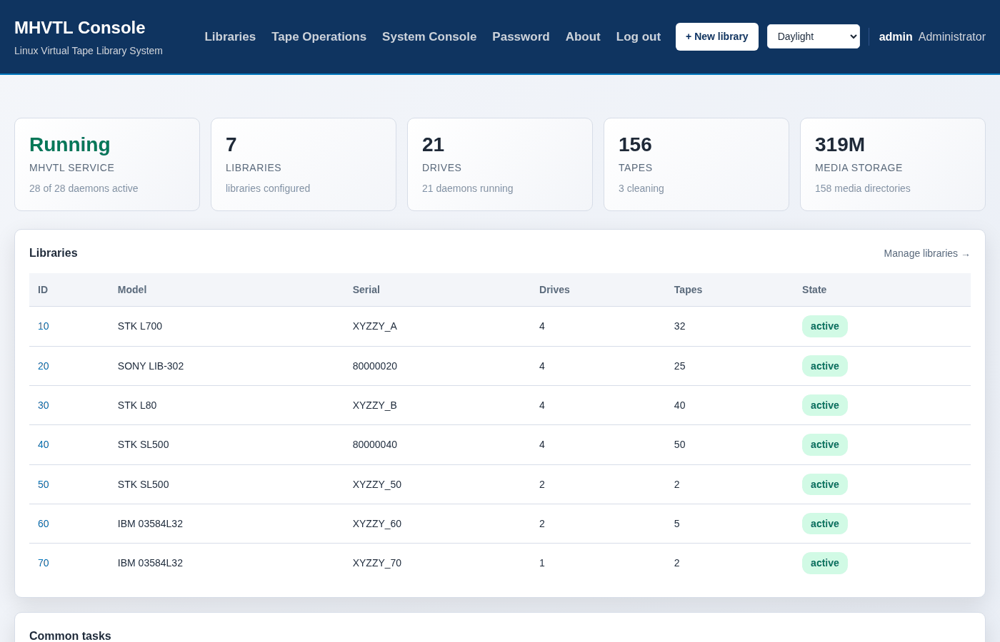
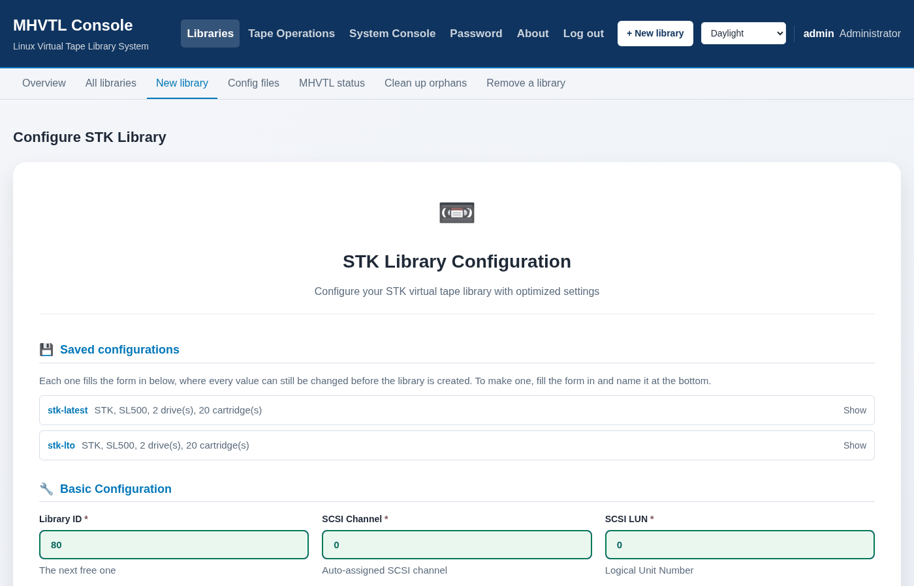
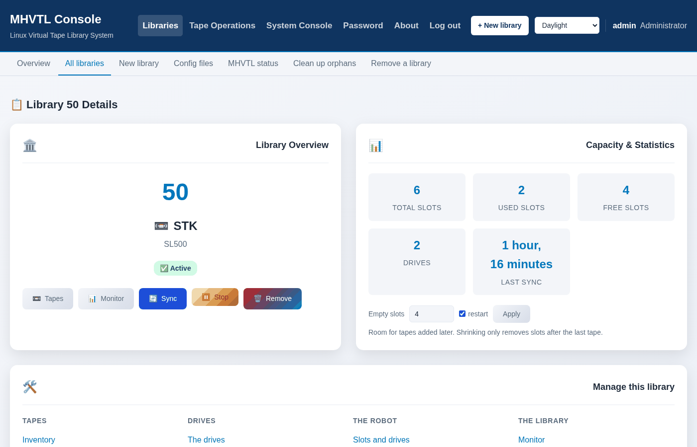
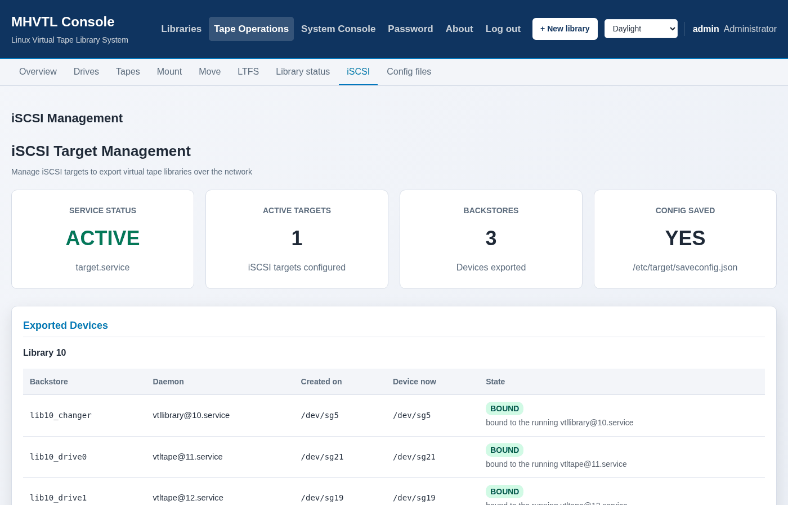

إن أردت أن تختبر كيف يتعامل برنامج النسخ الاحتياطي لديك مع الأشرطة، فأنت بحاجة إلى
مكتبة أشرطة. والمكتبة الحقيقية تكلّف ثمن سيارة وتأتيك على منصّة شحن.
[**MHVTL**](https://github.com/markh794/mhvtl) يحلّ هذه المشكلة: فهو يحاكي مُبدّل
وسائط من نوع SCSI ومشغّلاته برمجيًا، بدقّة تجعل Bacula وBareos وAmanda وNetBackup
عاجزة عن التمييز. يتولّى مارك هارفي صيانته منذ 2009، وهو برنامج جيد بحقّ.

أمّا إعداده فهو الجزء الذي لا يستمتع به أحد. تحرّر `/etc/mhvtl/device.conf` بيدك،
وتختار أرقام أهداف SCSI لا تتعارض، وتكتب ملفًا ثانيًا يسرد كل شريط، وتشغّل
`make_vtl_media`، ثم تعيد تشغيل وحدة systemd لكل مشغّل. وإن أخطأت في رقم واحد، تظهر
المكتبة وقد نقص منها مشغّل، دون أن يخبرك شيء أي رقم كان.

[**mhvtl-console**](https://github.com/abdelhaleemahmed/mhvtl-console) يتولّى هذا
الجزء. وهذه جولة في ما تراه وتفعله فعلًا — لا في كيفية بنائه.

## النظرة الأولى



هل الخدمة تعمل، وكم مكتبة موجودة، وكم مشغّلًا يعمل، وكم شريطًا هناك، وكم مساحة قرص
تشغلها. ثم كل مكتبة في سطر، مع طرازها ورقمها التسلسلي وحالتها.

كل ما في هذه الصفحة يُقرأ من `/etc/mhvtl/device.conf` في اللحظة التي تفتحها فيها.
للوحة قاعدة بيانات، لكن بصفتها *عرضًا* لا أكثر: إن حرّرت الملف بيدك، وافقتك الصفحة
عند التحديث التالي. وإن تعذّرت قراءة ملف، قالت الصفحة ذلك بدلًا من احتسابه صفرًا.

## بناء مكتبة



اختر مُصنّعًا، فتصبح قائمة الطرازات طرازاتِ ذلك المُصنّع. اختر طرازًا، فتصبح قائمة
المشغّلات هي المشغّلات التي يقبلها *ذلك الطراز*، وافتراضيُّه محدَّد سلفًا. اختر
مشغّلًا، فتصبح قائمة الوسائط هي الأشرطة التي يستطيع ذلك المشغّل الكتابة عليها.

**لا يمكنك بناء مكتبة غير موجودة**، لأن الخيار الخاطئ لا يُعرض أصلًا. فـ MHVTL يحاكي
أجهزة بعينها — فطراز IBM رقم `03584L32` يقبل سلسلة LTO، بينما `03584L22` يقبل مشغّلات
3592 ولا يقبل أي مشغّل LTO — والخطأ في هذا التركيب ينتج مكتبة تبدأ ثم تتصرّف بغرابة.

وهناك وضع معاكس لمن يعرف الشريط ولا يعرف العتاد: قل `LTO10` أولًا، فلا يُبقي لك إلا
المُصنّعين الذين تقبل مكتباتهم هذا الشريط.

ثم كم مشغّلًا، وكم فتحة، وكم فتحة تُترك فارغة. والافتراضي أربع، لأن مكتبة بلا فتحات
فارغة لا تستطيع استقبال شريط جديد دون إعادة تهيئتها. اضغط **Create**، فتكتب اللوحة
الملفّين، وتشغّل الخدمات، وتُنشئ الأشرطة.

## ما حجم الشريط؟

لكل صفّ من الأشرطة حجم، ويبدأ من **1 غيغابايت** لا من السعة الحقيقية للجيل. وهذا
مقصود، ويستحقّ فقرة لأن الخيار البديهي هو الخيار الخاطئ.

ملفات الوسائط في MHVTL *متفرّقة* (sparse): فالشريط بسعة 12 تيرابايت والشريط بسعة
غيغابايت واحد يشغلان كلاهما بضعة كيلوبايتات حتى يُكتب عليهما شيء، أي أن الحجم الواقعي
لا يكلّف قرصًا على الإطلاق. إنه يكلّف وقتًا. فبسرعة 55 ميغابايت في الثانية التي يكتب
بها مضيف نموذجي، يستغرق ملء شريط LTO-8 بسعته الأصلية نحو **61 ساعة** — وكل ما تريد
اختباره يقع في *نهاية* الشريط. هل يمتدّ النسخ الاحتياطي إلى الشريط التالي؟ هل يطلب
شريطًا؟ هل يُبلّغ المشغّل عن نهاية الوسيط؟ هل يتحرّك شريط الامتلاء؟ على شريط لا يستطيع
أحد ملأه، لا يمكنك الوصول إلى أيٍّ من ذلك.

فالشريط الصغير هو الافتراضي، والشريط الواقعي خيار تتّخذه أنت:

```console
$ sudo mhvtl settings set tape.size.LTO8 12TB
tape.size.LTO8 is now 12 TB (12,000,000 MB)
Tapes created from now on use this; the ones you already have keep the size they were made with.
```

و**System Console ← Settings** هي الشيء نفسه بصفته صفحة: سطر لكل نوع شريط، يبيّن
الحجم الذي سيُنشأ به، ومن أين جاءت هذه القيمة، وما تحمله هذه الجيل فعلًا إلى جانبها —
انقر ذلك الرقم لتستخدمه. والمكتبة التي تضمّ جيلين تحصل على حجم لكلٍّ منهما، لأن رقمًا
واحدًا سيمنح النوع الثاني سعةَ النوع الأول.

ولشريط واحد بالحجم الكامل دون تغيير أي إعداد:

```console
$ sudo mhvtl tape create 50 K50001L8 --size-mb 12TB
```

وتُكتب الأحجام `1000` أو `2000GB` أو `12TB` في كل موضع يُطلب فيه حجم، وهي عشرية — فشريط
LTO-8 يُباع على أنه 12 تيرابايت، أي 12,000,000 ميغابايت. أمّا `12TiB` فيُرفض ولا
يُحوَّل بصمت، لأن الفرق بين الاثنين عشرة في المئة.

## بناء المكتبة نفسها مرّة أخرى


سمِّ تهيئةً ما فتصبح **preset** — المكتبة كلّها في كلمة واحدة:

```
$ sudo mhvtl library create --preset ibm-latest --id 90
```

تُشحن إحدى عشرة تهيئة كأمثلة، واحدة لكل مُصنّع، كلٌّ منها عند أحدث شريط تستطيع
مشغّلات ذلك المُصنّع الكتابة عليه. والنقر على إحداها يملأ النموذج، حيث تبقى كل قيمة
قابلة للتغيير قبل أن تُنشئ أي شيء.

وممّا يجدر معرفته لأنه يفاجئ الناس: **افتراضي المُصنّع ليس أحدث ما لديه.** فـ IBM
افتراضيُّها مشغّل LTO-8 في حين يصل كتالوجها إلى LTO-10. وافتراضي Quantum هو SDLT600،
وهو ليس LTO أصلًا — فطلب «مكتبة Quantum» دون شيء آخر يعطيك مكتبة SDLT، وهذا صحيح،
وعلى الأرجح ليس ما قصدته.

## مراقبة مشغّل وهو يكتب

هذا ما تريده فعلًا عند اختبار نسخة احتياطية، وهو أصعب ممّا يبدو: فبينما يعمل النسخ
الاحتياطي، تحتفظ النواة بحجز SCSI للمُبادِر، فيجيب `mt status` و`mtx status`
بـ «Device busy» ولا يخبرانك شيئًا.

تسأل اللوحةُ خدمةَ المشغّل عبر طابور رسائل بدلًا من ذلك، وهو أمر لا علاقة له بـ SCSI
ويجيب أثناء عمل النسخ الاحتياطي.


سطر لكل مشغّل، يُحدَّث كل خمس ثوان: ما يحمله، وكم كُتب، وكم امتلأ الشريط. يتحوّل
الشريط البياني إلى الكهرماني بعد 75% وإلى الأحمر بعد 90%. والمشغّل الفارغ يقول
`empty`؛ والمشغّل الذي يحمل شريطًا ولا يجري عليه شيء يقول `holding`؛ وتبقى العدّادات
على آخر أرقامها حتى يُفرَّغ الشريط، فتظل نسخة احتياطية منتهية تُظهر ما كتبته.

## صفحة مكتبة واحدة



ما هي المكتبة، وما يفعله كل مشغّل، ومربّع لكل شريط يبيّن مقدار امتلائه، وروابط إلى كل
ما يمكنك فعله بها: إنشاء أشرطة، ونقلها بين الفتحات والمشغّلات، والتحميل والتفريغ،
وإضافة مشغّل، وإزالة المكتبة.

وتستطيع المكتبة أن تضمّ أكثر من جيل: مشغّلَي LTO-10 ومشغّلَي LTO-9 معًا، وهذا ما يبدو
عليه موقع حقيقي بعد عام من الترقية. وعندما تفعل ذلك، يجيب أمر واحد عمّا يستطيع هذا
التركيب تحميله فعلًا:

```
$ mhvtl tape media 10
DENSITY  SUFFIX  USE         IN DRIVES
-------  ------  ----------  -----------
LTO8     L8      read/write  ULT3580-TD8
LTO7     L7      read/write  ULT3580-TD8
LTO6     L6      read/write  ULT3580-TD6
LTO5     L5      read/write  ULT3580-TD6
LTO4     L4      read-only   ULT3580-TD6
```

والسطر الذي يستحقّ القراءة هو `read-only`. فذلك الشريط يمكن تحميله وقراءته، وسترفض
المكتبة إنشاء شريط جديد منه — لأن مشغّل LTO-6 يقرأ LTO-4 ولا يستطيع الكتابة عليه.

## أن تفقد شريطًا ثم تستعيده

احذف مكتبةً دون أن تطلب حذف وسائطها، تبقَ الأشرطة على القرص مع كل ما كُتب عليها.
و**التبنّي** (adopt) يعيد الشريط إلى مكتبة، ببياناته كاملة، دون نسخ أو إعادة كتابة.

ولا تعرض القائمة إلا المكتبات التي تستطيع مشغّلاتها تحميل ذلك الشريط فعلًا، ويقول سطر
الأوامر أين يمكن أن يذهب عندما يرفض:

```
$ sudo mhvtl tape adopt 20 I60006L7
mhvtl: No drive in library 20 loads LTO7 tapes; its drives take AIT4, AIT3, AIT2
LTO7 can go in: library 10 (STK L700), library 50 (STK SL500), library 60 (IBM 03584L32)
```

والمعيار هو هل يستطيع مشغّل *قراءته*، وهو معيار أوسع من القدرة على الكتابة — فمشغّل
LTO-7 يقرأ LTO-5، والتبنّي يستعيد ما هو موجود على الشريط أصلًا.

## تسليمها إلى جهاز آخر



مكتبة الأشرطة الوهمية أنفع عندما يكون خادم النسخ الاحتياطي في مكان آخر. تقود اللوحة
هدفَ LIO في لينكس لتصدير مكتبة عبر iSCSI — المخازن الخلفية، والأهداف، وCHAP،
والارتباطات مسجّلة لتبقى بعد إعادة التشغيل، وهي بالإعداد الافتراضي لا تبقى.

## كل ذلك من الطرفية

لكل ما سبق أمرٌ مقابل، لأن صفحة الويب وسطر الأوامر ينادِيان الشيفرة نفسها. ولا شيء
يُقرَّر في JavaScript.

```console
$ sudo mhvtl library create --profile IBM --id 50 --drives 2 \
     --media-type LTO8 --drive-model ULT3580-TD8 --tapes 3 --empty-slots 3

ok   validate  Specification is valid
ok   create    Library 50 created: IBM 03584L32 with 2 drives
ok   restart   Restarted vtllibrary@50.service
ok   verify    MHVTL can see library 50
ok   media     3 tape(s) created, 0 already present in library 50
Library 50 created
```

كل خطوة تُبلّغ عن نفسها، والفشل يسمّي الخطوة ويترك التهيئة كما كانت. أضف `--dry-run`
لطباعة ملف `device.conf` الذي *كان* سيُكتب ثم التوقّف، أو `--interactive` لتُسأل سؤالًا
واحدًا في كل مرّة، ولا تُعرض عليك إلا الأجوبة التي ما زالت ممكنة.

## كيف تحصل عليها

على Rocky Linux أو AlmaLinux أو RHEL 9، مع MHVTL 1.7 أو أحدث:

```bash
sudo dnf install mhvtl-gui-3.4.0-1.el9.noarch.rpm
```

وللتوزيعات الأخرى أرشيف tar مع مُثبِّت. ثم افتح `https://your-server/` — وكلمة المرور
الأولى هي `mhvtl`، وتطلب منك اللوحة تغييرها.

- **المصدر والإصدارات:** [github.com/abdelhaleemahmed/mhvtl-console](https://github.com/abdelhaleemahmed/mhvtl-console)
- **دليل المستخدم**، بالعربية والإنجليزية: [abdelhaleemahmed.github.io/mhvtl-console](https://abdelhaleemahmed.github.io/mhvtl-console/)
- **MHVTL نفسه**، وهو من يقوم بالعمل الحقيقي: [github.com/markh794/mhvtl](https://github.com/markh794/mhvtl)

ما زالت الحزمة تُسمّى `mhvtl-gui` — فهذا هو مسار الترقية للمضيفات التي لديها واحدة
بالفعل. أمّا البرنامج فيسمّي نفسه `mhvtl-console`.

وكيف بُنيت، والقاعدة التي شدّت المتصفّح وسطر الأوامر إلى بعضهما، وعِلّة نواة لينكس
التي كشفها على الطريق — كل ذلك مقالٌ أطول بذاته:
[**داخل mhvtl-console**]().
