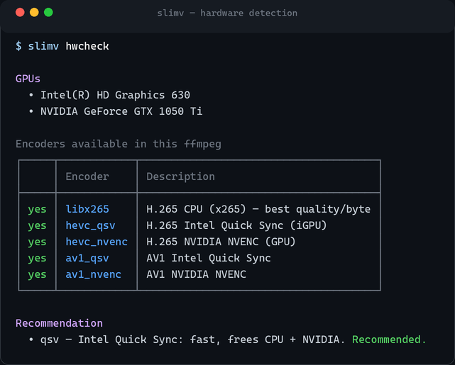
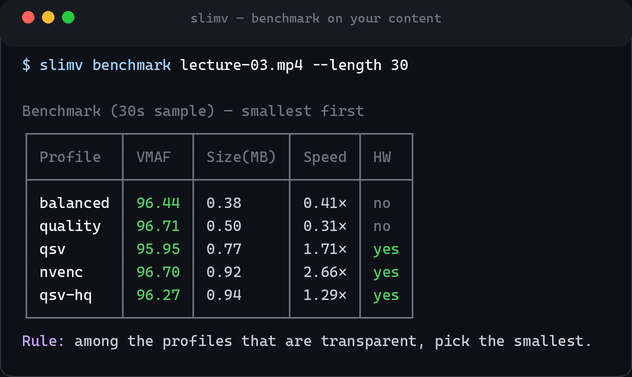
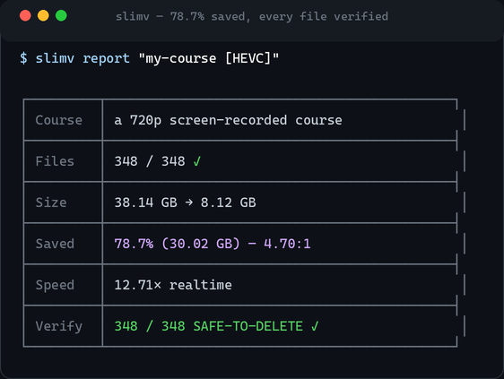

I recently pointed a small tool at years of accumulated video — software courses,
recorded lectures, tutorials — and reclaimed **about a terabyte of disk**. The
savings ran **60–88% per course**, the quality is indistinguishable, and I lost
**exactly zero files**. The tool is [**slimv**](https://github.com/abdelhaleemahmed/slimv),
and this is how it works — and why each piece exists.

## The waste hiding in your drives

Most of that video is **H.264**, a codec that's more than a decade old. Its
successors do dramatically better for the same picture:

- **H.265 / HEVC** typically **halves** the size of an H.264 file at equal
  quality — often much more for screen-recorded content.
- **AV1** squeezes even further, at the cost of slower encoding and thinner
  device support.

So the opportunity is real and large. The reason people *don't* take it comes down
to two fears, both legitimate:

1. **"I'll wreck the quality."** Pick the wrong setting and you get mush or
   banding.
2. **"I'll lose a file."** Re-encode, delete the original, and only *later*
   discover the new copy is truncated or won't decode.

slimv is built to remove both fears — and one subtle trap underneath them, which
I'll get to. It's a small, ffmpeg-driven command-line toolkit: it **never encodes
video itself**. It inspects your hardware, benchmarks encoders on your own footage,
builds the right ffmpeg commands, runs them, and — crucially — **verifies every
output before you delete a single source.**

> The deep "why" behind the codecs, quality metrics, and dials lives in the docs'
> guide,
> [**Understanding & Compressing Video Files Without Losing Quality**](https://abdelhaleemahmed.github.io/slimv/docs/understanding-video-compression.html).
> This post is the practical tour.

## slimv's contract

Three principles run through everything:

- **Quality first, then size.** Every profile keeps resolution, frame rate, and
  pixel format. The target is *visually transparent* output at the smallest size —
  never a quality trade you can see.
- **Measure on your own content.** slimv decides with data from *your* footage, not
  folklore from a forum post.
- **Never delete a good source for a broken copy.** Verification is a hard gate,
  not an afterthought.

The workflow is four steps: **know your hardware → measure → encode → verify.**

## Step 1 — Know your hardware

Fast, CPU-free encoding depends on your GPU, and which encoders ffmpeg can actually
reach isn't obvious. `slimv hwcheck` probes them — Intel Quick Sync, NVIDIA NVENC,
AMD AMF — and recommends a lane:



Why it matters: an Intel iGPU's `qsv` encoder is roughly **2× faster** than the CPU
*and* runs on silicon that would otherwise sit idle, leaving both your CPU and any
discrete GPU free for other work. Pair it with slimv's zero-copy `--hwdec` decode
pipeline and the CPU barely moves during an encode. (Setup details:
the [**Using the iGPU** guide](https://abdelhaleemahmed.github.io/slimv/docs/using-the-igpu.html).)

## Step 2 — Measure on your own content

This is the step most guides skip, and it's the one that matters most. Here's the
trap I promised: **bitrate does not predict compressibility.** Two 1-Mbps 720p
files can behave in opposite ways —

- a **static screencast** (a code editor, slides, handwriting) crushes 80%+;
- a **noisy live-camera lecture** at the *same* bitrate barely moves, because real
  motion and sensor grain are genuinely hard to compress.

Resolution and bitrate won't tell you which you have. So don't guess —
`slimv benchmark` encodes a short sample with several **profiles** and scores each
with **VMAF** (Netflix's perceptual quality metric, where ~95+ is transparent for
natural video and ~92 reads transparent for screen/text):

> A **profile** is a named, quality-preserving recipe — a codec plus its quality
> setting — like `qsv-hq` (Intel Quick Sync HEVC, high quality), `nvenc-hq`
> (NVIDIA NVENC HEVC), or `balanced` (x265 on the CPU). Resolution, frame rate, and
> pixel format never change. Full list in the
> [profiles catalog](https://abdelhaleemahmed.github.io/slimv/docs/03-profiles.html).



The rule is simple: *among the profiles whose quality is acceptable, pick the
smallest.* `slimv recommend` will make that call for you, and `slimv analyze` will
scan a whole library and project the reclaimable space before you commit.

### A word on profiles and quality dials

The built-in catalog spans the useful range — `archive` (x265 CRF 18, smallest and
slowest), `balanced` and `quality` (x265 on the CPU), `qsv` / `qsv-hq` (Intel Quick
Sync), `nvenc` / `nvenc-hq` (NVIDIA), and AV1 variants. Each is a *starting point*
you tune to your content.

One thing worth internalizing: the quality dials **run backwards and aren't
comparable across codecs.** `--crf` (x265/AV1), `--gq` / `global_quality` (QSV), and
`--cq` (NVENC) all mean "lower number = higher quality = bigger file," but a CRF of
20 and a CQ of 20 are *not* the same picture. That's exactly why you benchmark
rather than copy a number from someone else's setup. Audio is normalized to AAC
128k (transparent for speech; raise it with `--audio-kbps` for music), and a
`profiles.toml` lets you define your own encoder entirely.

## Step 3 — Encode the whole tree

`slimv encode` mirrors a source folder into HEVC and never touches resolution,
frame rate, or pixel format. The details that make it usable at library scale:

- **Resumable.** Interrupt it, reboot, re-run — it skips finished files and picks
  up where it stopped. A 400-file course that dies at file 300 doesn't start over.
- **CPU-free on a GPU.** `--hwdec` runs a zero-copy decode→encode pipeline on the
  iGPU, so the heavy H.264 decode leaves your CPU almost idle for other work.
- **Safe by construction.** `--keep-smaller` refuses to let a file *grow* (some
  already-efficient clips would), and `--copy-audio` streams the original audio
  through untouched when it's already fine.
- **Per-run dials.** `--cq` / `--crf` / `--gq`, `--preset`, and `--scale` push size
  when you know the content can take it.

Every file is logged — size in, size out, saved %, speed.

## Step 4 — Trust, then delete

Here's the safety net, and the feature I'm proudest of. `slimv verify` full-decodes
every output and **reconciles its frame count against the source.** Only files that
decode cleanly *and* match are marked **SAFE-TO-DELETE**; anything short or corrupt
is flagged **KEEP-SOURCE**, and `--list-corrupted` prints the exact paths. It's
**resumable and shardable**, so you can verify a huge library in parallel across
processes and resume after an interruption.

That frame-count reconciliation also handles a genuinely nasty edge case: old
DivX/Xvid `.avi` files often carry an **inflated duration** in their header. A
faithful re-encode captures every real frame but comes out "shorter" than the
header claimed — which naïve length checks read as truncation. slimv doesn't fall
for it: it compares *decoded frames*, confirms nothing is missing, and marks the
file safe. It also correctly refuses the opposite case — a genuinely truncated or
corrupt output — and keeps the source.

`slimv report` and `verify-report` roll the logs into a live box. This one is real,
from an actual course in my library:



**348 files, 38.14 GB → 8.12 GB — 78.7% smaller, and all 348 verified safe to
delete.** That bottom line is the whole point: the source wasn't removed until
slimv proved the replacement was intact.

## What actually compresses (real numbers)

Because slimv reports the truth per file, I can show it honestly. Same tool, same
`cq`/`crf` territory — wildly different outcomes, driven by **content type, not
resolution or bitrate**:

| What it is | Typical bitrate | Real saving |
|---|---|---|
| Static screen — code editor, slides, handwriting | ~0.5 Mbps | **83–89%** |
| Diagrams & networking labs | ~2 Mbps | **70–75%** |
| Screencast + talking-head mix | ~1 Mbps | **55–60%** |
| Live-camera lecture (whiteboard) | ~0.9 Mbps | **~48%** |
| 3D render / high-motion | high | **grows — kept as-is** |

Notice the bottom two rows share a bitrate band with the *top* rows and still
behave completely differently. That's the entire argument for benchmarking first —
and for `--keep-smaller`, which quietly protects the files that would only get
bigger.

## Hardware and big batches

On the two-GPU machine I ran this on, the split was: **Intel Quick Sync** (`qsv-hq`)
for a steady, CPU-free stream, and **NVIDIA NVENC** (`nvenc-hq`) for the fastest
throughput on the largest courses. Because verify is decode-only and encode is
encode-only, the two phases can even overlap on different silicon. slimv handles the
resumability and logging so an overnight, multi-hundred-gigabyte run just... finishes,
and you wake up to a report.

## The payoff

Across the whole library it came to **~1 TB reclaimed**, at **60–88% per course**,
with **zero files lost** — every source verified before deletion. Shrinking video is
easy; doing it without ever risking a source is the hard part, and it's the entire
reason slimv exists.

## Get it

slimv is MIT-licensed and needs Python 3.9+ plus **ffmpeg/ffprobe** on your `PATH`:

```bash
pip install https://github.com/abdelhaleemahmed/slimv/releases/download/v0.3.1/slimv-0.3.1-py3-none-any.whl
```

- **Code:** https://github.com/abdelhaleemahmed/slimv
- **Docs:** https://abdelhaleemahmed.github.io/slimv/ — including the
  [compression guide](https://abdelhaleemahmed.github.io/slimv/docs/understanding-video-compression.html),
  the [profiles catalog](https://abdelhaleemahmed.github.io/slimv/docs/03-profiles.html),
  and the [iGPU guide](https://abdelhaleemahmed.github.io/slimv/docs/using-the-igpu.html).

If your drives are full of video you're afraid to touch, slimv is built to let you
shrink it — and *prove* it's safe before you delete a thing.
