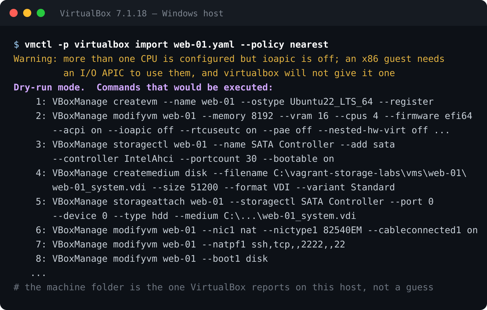
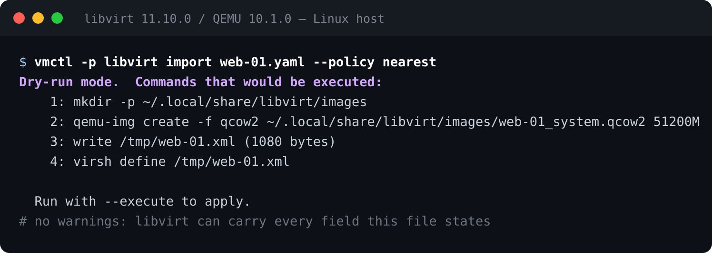
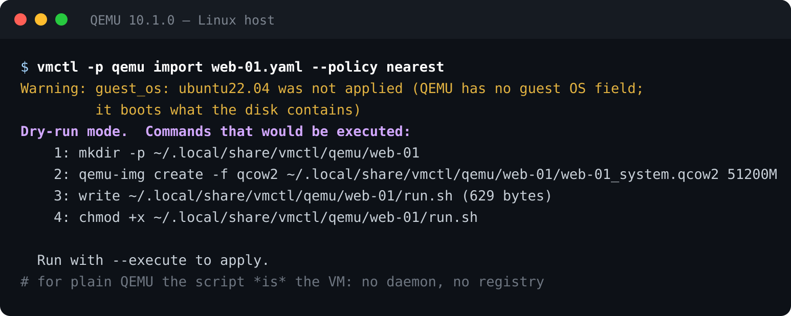
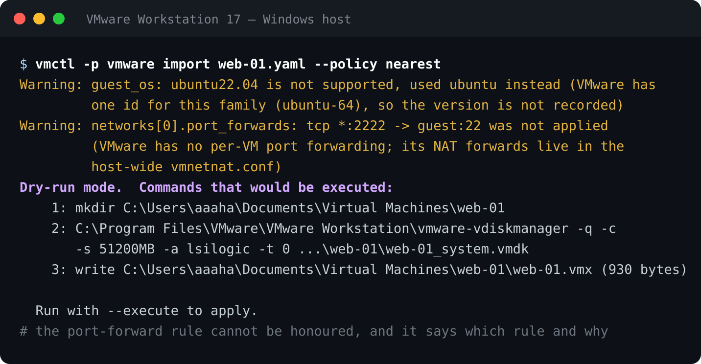
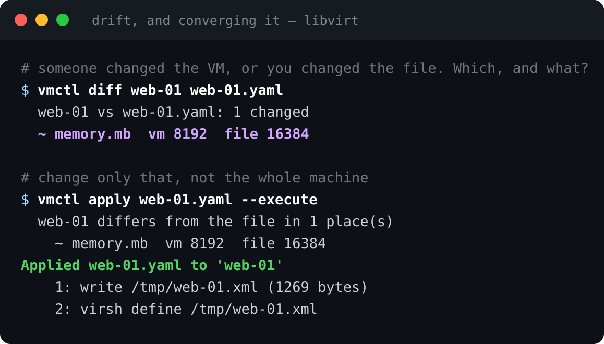
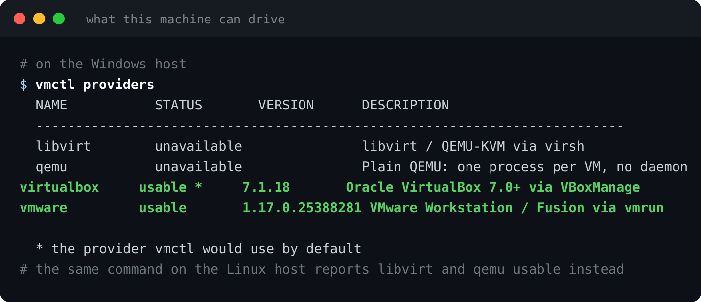

When I [wrote about vmctl](../vmctl/) a few weeks ago, it drove VirtualBox, and
libvirt and QEMU were "on the roadmap". That sentence was doing a lot of work. Getting
from one hypervisor to four turned out to be less about writing three more backends
and more about discovering how much of what I *believed* about each hypervisor was
wrong.

vmctl 4.0 drives **VirtualBox, libvirt/QEMU-KVM, plain QEMU and VMware Workstation**.
The same file, the same commands, on any of them. This post is about what that
actually took, because the interesting parts were not the parts I expected.

## The same file, four hypervisors

Here is one configuration:

```yaml
# web-01.yaml
name: web-01
guest_os: ubuntu22.04
cpu:
  count: 4
memory:
  mb: 8192
firmware:
  type: efi64
storage:
  - name: system
    size_mb: 51200
    bus: sata
    bootable: true
networks:
  - network_type: nat
    port_forwards:
      - name: ssh
        host_port: 2222
        guest_port: 22
```

And here is that file against each hypervisor, dry-run, exactly as it came out. Note
that nothing here is a translation table — each provider builds its own native thing:










VirtualBox gets a VDI and a NAT port-forward rule. libvirt gets a qcow2 and a domain
XML. Plain QEMU gets a directory with a runnable command line in it — for that
provider, the script *is* the VM; there is no daemon and no registry. VMware gets a
VMDK and a `.vmx`.

**The warnings are the point.** Four hypervisors do not have the same features, and
the honest thing is to say so per field rather than to pretend. QEMU has nowhere to
record which guest OS this is. VMware's NAT forwards are host-wide, not per VM, so the
rule cannot be honoured — and it says which rule, and why. `--policy strict` refuses
instead of substituting; `--policy nearest` substitutes and tells you what it changed.

## The capability tables are measured, not read from documentation

This is the part I would not have predicted. Every "can this hypervisor do that?"
answer in vmctl was established by *asking the running product*, and each provider
declares where its numbers came from:

```console
$ vmctl -p libvirt capabilities
...
buses:
  bus           disk    cdrom   floppy  ports
  ide           yes     yes     -       1-2 x 2
  sata          yes     yes     -       1-6   <- native for cdrom
  usb           yes     yes     -       1-8
  virtio-blk    yes     yes     -       1-32   <- native for disk
  virtio-scsi   yes     yes     -       1-256

evidence: probed on libvirt 11.10.0 / QEMU 10.1.0, machine q35. The formats were
re-measured against `-drive format=help` and by starting a domain per format: this
build attaches only qcow2 and raw read-write, and the NIC models by starting one per
model, which left four. For libvirt, define-time acceptance is evidence of nothing:
it takes a vmxnet3 or a VMDK happily and then fails to start the domain.
```

Read that last sentence again, because it cost me a day. **libvirt will accept a
domain definition and then fail to start it.** If you build a capability table by
checking what `virsh define` accepts, you get a table that is wrong in a way that only
shows up later, on someone else's machine. The only reliable test was to define a
domain *and start it*, one per combination, and record what survived.

A concrete consequence: there is **no disk image format that all four can create.**
VirtualBox creates seven, libvirt and QEMU two each, VMware exactly one, and the
intersection is empty. So a config that pins `format: qcow2` is portable to two of the
four; leave the format out and each hypervisor uses its own. vmctl knows which is
which, per host, because it measured.

## Drift: what changed since you wrote the file

The first post had describe → preview → apply. The thing it was missing is what
happens three weeks later, when somebody has clicked something in a GUI:



`apply` changes **only what drifted**, not the whole machine, and it will not re-create
a disk the VM already has. That last part was a bug once, and an expensive one: an
early version of `edit` re-created disks, which on some providers meant deleting data.
There is now a single rule about it, and a conformance test that every provider has to
pass.

`diff` also compares only what the file actually *states*. A default is not a request,
so a file that never mentions `vram_mb` does not report drift because the hypervisor
picked a number.

## Changing things without editing the file

`import` used to accept a new name and a disk format, and nothing else — so the two
things anyone actually wants to vary could not be varied:

```console
$ vmctl import web-01.yaml --set memory.mb=4096 --set cpu.count=8
$ vmctl import web-01.yaml --add-disk size_mb=40960,bus=virtio-blk,format=qcow2
$ vmctl import web-01.yaml --add-nic network_type=bridged,model=virtio
$ vmctl import web-01.yaml --patch bigger.yaml
```

These are merges over the configuration *before* it becomes a VM, using the same merge
that `extends:` uses for file inheritance — so an overridden field is validated,
capability-checked and translated exactly like a written one. `--add-disk
format=vdi` against VMware is refused under `strict` and substituted under `nearest`
with no special-casing anywhere.

And when two flags disagree, it says which won rather than picking silently:

```console
note: storage[1].format is 'qcow2' from --add-disk, which outranks --disk-format ('vdi')
```

## Moving a VM to a different hypervisor

```console
$ vmctl migrate web-01 --to qemu --policy nearest
web-01 (libvirt) -> web-01 (qemu)
Configuration only: the new VM gets blank disks. Pass --with-disks to bring the data.
Warning: guest_os: ubuntu22.04 was not applied (QEMU has no guest OS field)
Warning: firmware.secure_boot: True was not applied (secure boot needs an OVMF
         variables file per VM)
Dry-run mode.  Commands that would be executed:
    2: qemu-img create -f qcow2 ~/.local/share/vmctl/qemu/web-01/web-01_sda.qcow2 51200M
```

Configuration by default, disks on request, and a plain statement of everything that
did not survive the trip.

## Does this machine work at all?

Two commands I use more than I expected. `doctor` answers "can this host run a VM,
and why is it slow":

```console
$ vmctl doctor
provider: libvirt
[ok  ] python: 3.13
[--  ] hardware virtualisation: unavailable; guests will be emulated and slow
         hint: on a nested setup, enable VT-x/AMD-V for this VM; otherwise check that
               /dev/kvm exists and you are in the group that may use it
[ok  ] virsh: /usr/bin/virsh
[ok  ] libvirt version: 11.10.0
[--  ] free space there: 10957 MB
[ok  ] connection works: yes, 0 domain(s)
[--  ] domain type: qemu (emulated)
```

`providers` answers the other half — what this machine can drive at all, and which
vmctl would pick:



And `selftest` proves the hypervisor agrees with vmctl by creating a throwaway VM,
exercising it and deleting it — ten checks, on real hardware, in a few seconds.

Snapshots are there too, with the description field that most tools drop:

```console
$ vmctl snapshot take web-01 before-upgrade -d "kernel 6.9, rolling back if it panics"
Took snapshot 'before-upgrade' of 'web-01'

$ vmctl snapshot list web-01
* before-upgrade  2026-09-29 19:26:44 +0000  shutoff  -- kernel 6.9, rolling back if it panics
```

## The uncomfortable part: tests are not evidence

I want to be straight about how the real bugs in this thing were found, because it
changed how I work.

At one point vmctl had **1194 passing tests** and a `selftest` command that reported
10/10 against two real hypervisors. With all of that green, this was true:

```console
$ vmctl export web-01 -o web-01.json     # a .json file
$ head -1 web-01.json
name: web-01                              # ...containing YAML
```

`--format` had a default, so the command could not tell "not given" from "given as
yaml", and the inference its own help text promised never ran. No test caught it
because no test had ever asked for a `.json` file without also passing `--format`. My
test suite and my `selftest` were both written against my own idea of the tool, so
when that idea was wrong they agreed with each other and passed.

So I wrote a harness that drives the command line the way a person does, on real
hypervisors, and **reads the files that land on disk**: for every image format each
provider can create, on every bus that can carry a disk, create a real VM, export it,
re-import it, diff the export against the VM, delete it, confirm it is gone. Twenty-one
real VMs, 336 checks, all four hypervisors — VirtualBox and VMware over SSH to a
Windows host, libvirt and QEMU locally.

It found five defects in an afternoon. Three of them broke the round trip, which is the
one thing the tool exists to do:

- exporting a libvirt VM and re-creating it **while the original still existed** was
  impossible: the export carries the domain UUID, so libvirt refused the second domain
- a QEMU VM with two disks on `virtio-scsi` or `usb` could not be re-imported, because
  the emitter never recorded which LUN each disk had and both read back at port 0
- on Windows, `export` wrote the file correctly and then **died printing that it had** —
  `UnicodeEncodeError` on an arrow character the console's code page has no room for

None of those were visible to the test suite. Two more turned up later the same way,
one of them a regression I shipped in two releases: `vmctl providers` printed an empty
table, because the registry depended on an unrelated import that I had removed. The
test asserting the providers were registered had itself imported the module that
registered them.

The report is generated and committed, so it cannot drift from what the runs actually
recorded, and there is an asciinema cast per hypervisor.

## If you want to see what it is doing for you

I wrote a documentation page that builds one VM with `virsh` and `qemu-img` alone —
the disk, the 38-line domain XML, define, start, change the memory, tear it down — and
then builds the same VM with vmctl:
[**Creating a VM with virsh, by hand**](https://abdelhaleemahmed.github.io/vmctl/docs/guide/virsh-by-hand.html).
Every command and error on that page was run.

Three things from it that are worth knowing whether or not you ever use vmctl:

- libvirt stores a *different document* from the one you hand it — 38 lines in, 146
  out — so `dumpxml` never matches your file and the two cannot be diffed
- `setmaxmem --config` is accepted on a running domain and changes only the stored
  definition, so the persistent and live values differ with no warning
- `undefine --remove-all-storage` **leaves the disk behind** when the image is not in a
  libvirt storage pool, reports that, undefines the domain anyway, and exits 0

vmctl emits `virsh` commands; it is not a replacement for knowing them. Storage pools,
libvirt networks, live migration and hotplug are all still `virsh`'s job.

## Get it

vmctl is MIT-licensed and needs **Python 3.13 or later** — that floor moved, and moved
deliberately, because supporting 3.8 was itself producing defects. It is not on PyPI,
so install the wheel from the release:

```bash
pip install https://github.com/abdelhaleemahmed/vmctl/releases/download/v4.0.3/vmctl-4.0.3-py3-none-any.whl
```

Then, before anything else:

```bash
vmctl doctor      # what this machine can do
vmctl selftest    # proof the hypervisor agrees, on a throwaway VM
```

- **Code:** https://github.com/abdelhaleemahmed/vmctl
- **Docs:** https://abdelhaleemahmed.github.io/vmctl/ — English and Arabic
- **Releases:** https://github.com/abdelhaleemahmed/vmctl/releases

One note if you read the first post: `--apply` is now `--execute`. It had to change,
because `apply` became a command in its own right, and one word cannot mean both "run
this plan" and "converge this VM".
