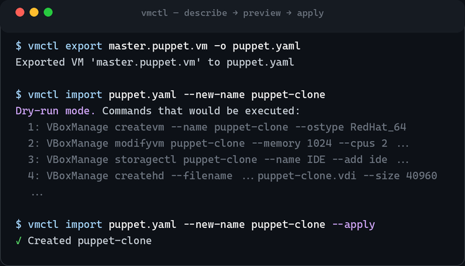
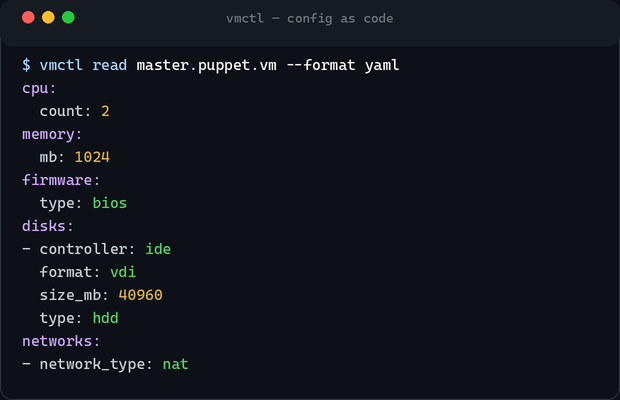
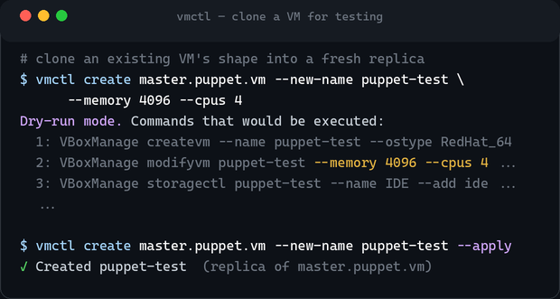
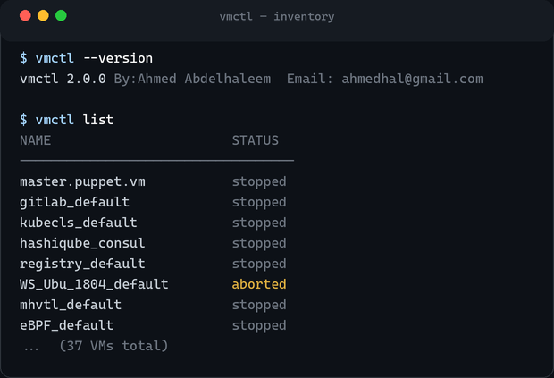

إنشاء جهاز افتراضي محلّي لا يزال يبدو وكأننا في 2010. إن كنت تستخدم VirtualBox
للتطوير أو الاختبار أو تمارين التعافي من الكوارث، فأنت تعرف الطقس المعتاد: النقر
عبر الواجهة الرسومية، أو لصق جدار من خيارات `VBoxManage` من ملاحظة كتبتها قبل ستة
أشهر. مرّة واحدة، لا بأس. أمّا أن تفعلها للجهاز الاختباري العاشر المطابق — أو أن
تحاول تسليم زميلك *نفس* الإعداد بالضبط — فهو عمل بطيء ومُعرَّض للأخطاء.

المُحبِط أننا حللنا هذا فعلًا — للسحابة. Terraform وPulumi وCloudFormation: صِف
البنية التحتية كبيانات، وراجِع خطّة، وطبّقها، واحتفظ بها في Git. قابلة للتكرار
وللمراجعة، ومملّة بأفضل معنى. لكن الأجهزة الافتراضية على جهازك أنت لم تصلها الرسالة.

يسدّ [**vmctl**](https://github.com/abdelhaleemahmed/vmctl) هذه الفجوة. إنها أداة
سطر أوامر صغيرة تدير الأجهزة الافتراضية بأسلوب **الإعداد كشيفرة (config-as-code)**:
صِف الجهاز كملف YAML أو JSON بسيط، واحتفظ به في Git، وأعِد إنشاءه في أيّ مكان —
جهازًا واحدًا أو أسطولًا كاملًا — بنفس انضباط *الخطّة ← التطبيق* الذي يجعل «البنية
التحتية كشيفرة» جديرة بالثقة.

## الفكرة الجوهرية: صِف، عايِن، طبّق

الجهاز في vmctl مجرّد **بيانات** — معالج، وذاكرة، وبرنامج ثابت (firmware)، وأقراص،
وشبكات، وترتيب إقلاع. إمّا أن تكتب هذا المستند يدويًا أو تلتقط جهازًا قائمًا بـ
`export`. ومن هناك ثلاثة أفعال:

- **describe (الوصف)** — الإعداد *هو* الجهاز. قابل للمقارنة (diff)، وللمراجعة في طلب
  دمج، وللتكرار على أيّ مضيف.
- **preview (المعاينة)** — كل أمر يغيّر الحالة (`create`، `import`، `batch create`)
  هو **تشغيل تجريبي افتراضيًا**. يطبع أوامر المزوّد التي *سينفّذها* بالضبط دون أن
  يغيّر شيئًا.
- **apply (التطبيق)** — لا يبني فعليًا إلا حين تضيف `--apply`.



سلوك «التشغيل التجريبي افتراضيًا» هو نموذج الأمان بأكمله — نظير `terraform plan`
للأجهزة المحلّية. ترى دائمًا الأوامر الملموسة قبل أن يتغيّر الواقع. واللقطة أعلاه
تشغيلة حقيقية: أمر `import` يطبع أوامر `VBoxManage` العشرة التي سينفّذها، ولا يحدث
شيء حتى تكون `--apply` في السطر.

## الإعداد كشيفرة، بشكل ملموس

تعيش صورة الجهاز الكاملة في مستند واحد قابل للقراءة:



```bash
# التقاط جهاز حيّ إلى ملف قابل للإصدار، ثم أودِعه في Git
vmctl export web-server -o infra/web-server.yaml
git add infra/ && git commit -m "Add web server VM definition"
```

الحقل `name` وحده مطلوب فعلًا؛ وكل ما عداه يرجع إلى قيم افتراضية معقولة. الآن صارت
تعريفات أجهزتك جزءًا من قاعدة شيفرتك — مُراجَعة ومُقارَنة ومُؤَرشَفة — بدل أن تعيش في
ذاكرتك وفي مقتطفات صدفة متناثرة.

## ينمذج عتادًا حقيقيًا — ويتحقّق منه

‏vmctl ليست غلافًا رفيعًا حول `VBoxManage`. لديها نموذج فعلي لعتاد الأجهزة
الافتراضية، و**تتحقّق من صحّة الإعداد مقابل قدرات المزوّد الهدف قبل أن تبني أيّ
شيء**، فلا تكتشف متحكّم قرص خاطئًا في منتصف الطريق:

| الفئة | المدعوم |
|---|---|
| **متحكّمات التخزين** | IDE، SATA، SCSI، SAS (حتى 255 قرصًا لكل متحكّم) |
| **الأقراص** | HDD، SSD، CD/DVD |
| **صيغ الأقراص** | VDI، VMDK، VHD، RAW — رفيعة (ديناميكية) أو سميكة (ثابتة) |
| **البرنامج الثابت** | BIOS، EFI (32/64)، الإقلاع الآمن، TPM |
| **الشبكات** | NAT، جسر (Bridged)، مضيف فقط (Host-only)، داخلية، شبكة NAT (حتى 8 مهايئات) |
| **أجهزة الإقلاع** | قرص، dvd، قرص مرن، شبكة |

ينفّذ `vmctl validate <file>` تلك الفحوص عند الطلب؛ ويُظهر `vmctl read` و`vmctl list`
ما هو موجود فعلًا.

## استنساخ جهاز لاختبار السيناريوهات

أحيانًا لا تريد جهازًا جديدًا من الصفر — تريد *هذا* الجهاز مرّة أخرى، لتجرّب أمرًا
محفوفًا بالمخاطر دون المساس بالأصل. يستنسخ `create` صورة جهاز قائم إلى نسخة جديدة،
ويتيح لك تعديلها في الطريق:



```bash
# نفس صورة الأصل، لكن 4 غيغابايت / 4 معالجات افتراضية، وباسم جديد
vmctl create master.puppet.vm --new-name puppet-test --memory 4096 --cpus 4 --apply
```

أنشئ من النسخ المطابقة ما تحتاج — لاختبار ترقية أو تغيير إعداد أو سيناريو فشل —
بينما يبقى الأصل كما هو تمامًا. والعملية تصدير/استيراد في العمق، فالنسخة معرَّفة بنفس
«الإعداد كشيفرة» الذي يمكنك إيداعه ومشاركته.

## أساطيل كاملة من ملف واحد

تحوّل عمليات الدُّفعات قالبًا واحدًا إلى أجهزة كثيرة، لكلٍّ تخصيصاته — يرث قاعدة
ويغيّر ما يهمّ:

```yaml
# cluster.yaml
name: dev-cluster
base_vm: ubuntu-template
instances:
  - name: dev-web-01
    memory: 4096
    cpu: 4
  - name: dev-db-01
    memory: 8192
    cpu: 8
    disks:
      - size_mb: 102400
```

```bash
vmctl batch create cluster.yaml --apply   # ويب + قاعدة بيانات، تُصنع دفعةً واحدة
```

## دورة الحياة الكاملة من واجهة واحدة

إلى جانب describe/apply، يغطّي vmctl الأعمال اليومية:



‏`list`، و`read`، و`start`، و`stop` (إيقاف لطيف عبر ACPI أو `--force`)، و`status`،
و`edit`، و`create`، و`export`، و`import`، و`delete`، و`validate`، و`batch` — أداة
واحدة بدل خريطة ذهنية لأوامر `VBoxManage` الفرعية.

## مبنيّة لتتجاوز مُحاكيًا واحدًا

البنية مُطبَّقة عمدًا: **محرّك أساسي** ونموذج إعداد، و**مزوّدون** قابلون للتوصيل خلف
واجهة رفيعة، و**مُسلسِلات** لـ YAML/JSON، و**مُتحقِّقات** لفحوص القدرات. VirtualBox
مدعوم بالكامل اليوم؛ و**libvirt/KVM وQEMU على خارطة الطريق** — ولأن وصلة المزوّد
رفيعة، ستنتقل نفس الأوامر ونفس الإعدادات عبرها. وإضافة مُحاكٍ تعني تنفيذ واجهة صغيرة
واحدة، لا إعادة كتابة الأداة.

## أين تثبت جدواها

- **بيئات تطوير قابلة للتكرار** — أمر `batch create` واحد ويصبح الفريق كلّه على إعداد
  مطابق، معرَّف في ملف يمكنك مراجعته.
- **اختبار التعافي من الكوارث / الاسترجاع على العتاد الفعلي** — صدّر صورة جهاز
  إنتاجي، وأنشئ نسخة، وتحقّق من الاسترجاع، ثم تخلّص منها.
- **بنية تحتية في Git** — تصير تعريفات الأجهزة شيفرة: مُراجَعة ومُقارَنة ومُؤَرشَفة،
  ويُعاد إنشاؤها عند الطلب.

## احصل عليها

‏vmctl مرخّصة برخصة MIT وتحتاج فقط Python 3.8+ وPyYAML (إضافةً إلى VirtualBox
لتشغيل الأجهزة فعليًا):

```bash
pip install https://github.com/abdelhaleemahmed/vmctl/releases/download/v2.0.0/vmctl-2.0.0-py3-none-any.whl
```

- **الشيفرة:** https://github.com/abdelhaleemahmed/vmctl
- **التوثيق:** https://abdelhaleemahmed.github.io/vmctl/

إن كنت تدير أجهزة افتراضية محلّية وتتمنّى لو تصرّفت أكثر كالشيفرة، فجرّبها — وإن أردت
مزوّدًا لا تملكه بعد، فالواجهة صغيرة وطلبات الدمج مُرحَّب بها.
